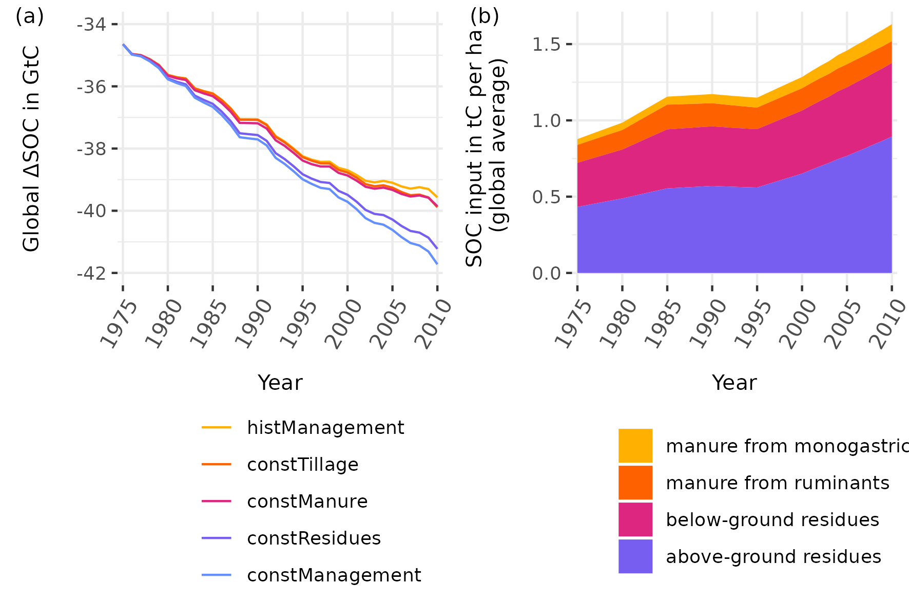

In the following we will provide an update on some of our main results in comparison to the version of our initial draft to help the reader understand the implication of our changes. The following major corrections and improvements have been made, that let to substantial changes (next to smaller improvements):

* We discovered a bug in the very core of the soil model, leading to an overestimation of the transfer of carbon from active to the slow pool *just* for cropland. In regions with high carbon inputs (e.g. UK or Central EU) this let to unreasonable high SOC stocks.
* Additionally, we found unreasonable high forage crop production values (especially for pumpkins used as fodder) in our input data, we used from FAO. This let to an additional decrease of residue inputs to the soil for several countries (including, Australia, Belgium and Germany). 
* We moreover improved the spin-up of our model by accounting for land-use change since 1510. 

The SOC debt is not decreasing anymore, but still continuing to increase, which is visible in the following figure.  


```{r captionSOCdebt, echo=FALSE}
captionSOCdebt <- "NEW!!! $\\Delta SOC$ is the difference between SOC under historic land use and potential natural vegetation and is also called the SOC debt. Within the period 1975 -- 2010 the SOC debt is continuing to increase."
```

```{r image_grobs, fig.show='hold', out.width = "70%", fig.align = "default", echo=FALSE, fig.cap = captionSOCdebt,}
library(cowplot)
library(ggplot2)

ggdraw() + draw_image("../ResultNotebooks/Output/Images/SOCemis.png")

```

\pagebreak

## SOC distribution and depletion

```{r captionSOCmaps, echo=FALSE}
captionSOCmaps <- "NEW!!! (a): Distribution of total global SOC stocks for the first 30 cm on cropland: Carbon stocks are large in high yielding areas. (b)+(c): Absolute (b) and relative (c) SOC stocks changes compared to a potential natural state identify different hotspots of SOC dynamics. Whereas absolute losses $\\Delta SOC$ are often highest in temperate dry regions, relative losses $F^\\mathrm{SCF}$ are often larger in tropical moist areas. (d): $\\Delta SOC$ between SOC under historic land use and potential natural vegetation is stopping to decrease vs. actally decrease over the the period 1975--2010. "
```

```{r SOCmaps, out.width = "16cm", fig.cap = captionSOCmaps, echo=FALSE, fig.pos="h"}
# All defaults
knitr::include_graphics("../ResultNotebooks/Output/Images/4panelfigure.png")
```
```{r SOCmaps2, out.width = "16cm", fig.cap = "OLD!!!", echo=FALSE, fig.pos="h"}
# All defaults
knitr::include_graphics("../../oldPaperVersion/ResultNotebooks/Output/Images/4panelfigure.png")
```
\pagebreak

With the figures above we provide a world map of SOC stocks for the first 30 cm on croplands considering historic management data at the global scale for the year 2010. Values ranging between well over $100\mathrm{t ha^{-1}}$ in northern temperate croplands to less than $5\mathrm{t ha^{-1}}$ for arid and semiarid croplands.

\pagebreak

## Agricultural management effects on SOC debt

```{r captionSOCscen, echo=FALSE}
captionSOCscen <- "NEW!!! (a) Global $\\Delta SOC$ in GtC for different management scenarios: The stylized scenarios devate from historic argicultural management by holding effects of carbon inflows from residues, manure constant or neglecting adoption of no-tillage practices. ConstManagement combines all three modifications. Note that $\\Delta SOC$ is defined as the difference of SOC under land-use compared to a natural vegetation state. Figure (b) shows the carbon inflows from crop residue and manure."
```

```{r SOCscen, out.width="10cm", fig.cap = captionSOCscen, echo=FALSE}
# All defaults

```
```{r SOCscen2, out.width="10cm", fig.cap = "OLD!!!", echo=FALSE}
# All defaults
knitr::include_graphics("../../oldPaperVersion/ResultNotebooks/Output/Images/scenario_horiz.png")
```

Most notably difference is the trend of the historical reference line as well as the split between stylized constManagement and the baseline histManagement. Before we calculated a split of $8\mathrm{GtC}$, that now decreased to around $2\mathrm{GtC}$, which is still a third of the SOC loss of the period from 1975 -- 2010.

\pagebreak


##  Modeled management effect in comparison with default IPCC Tier 1 factors

Stock change factors $F^{\\mathrm{SCF}}$ in comparison to IPCC Tier 1 default factors: Our updated results are much smaller and still too low compared with the default values of the IPCC in general.

```{r SCFglo, echo=FALSE,  results = 'asis'}
table <- readRDS("../ResultNotebooks/Output/SFC_comparison.rds")
library(xtable)
print(xtable(table$comparison_table, digit=2, label="tab:SCFglo",
             caption="NEW!!!"),
               comment=FALSE)
```

```{r SCFglo2, echo=FALSE, results = 'asis'}
table <- readRDS("../../oldPaperVersion/ResultNotebooks/Output/SFC_comparison.rds")
library(xtable)
print(xtable(table$comparison_table, digit=2, label="tab:SCFglo",
              caption="OLD!!!"), comment=FALSE, caption.placement = "top")
```

