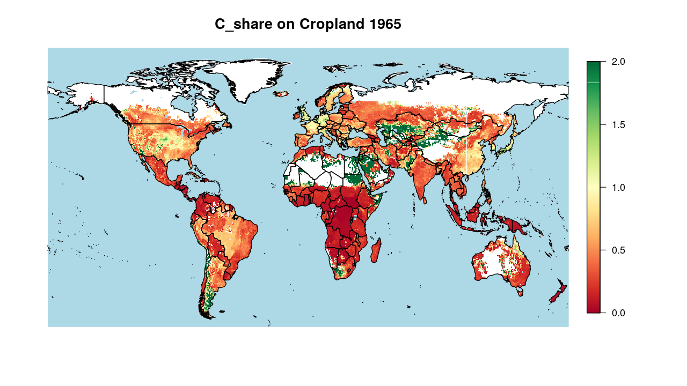
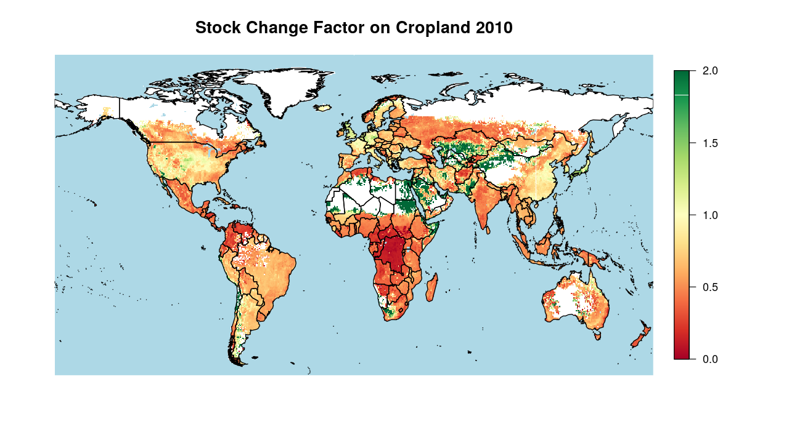
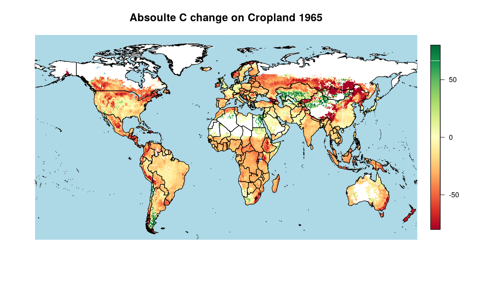
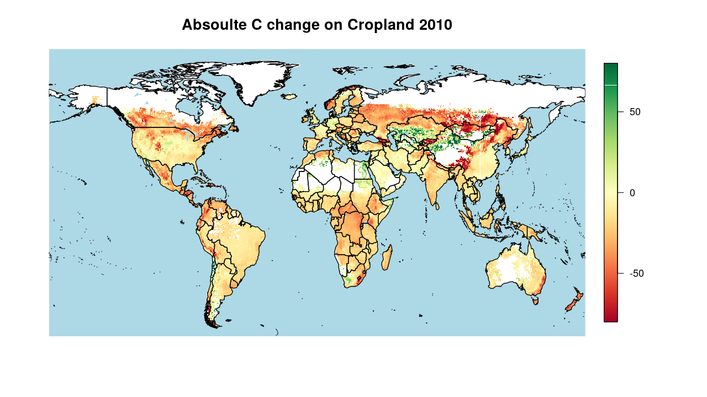

Introduction text goes here. You can change the name of the section if
neccessary using `\introduction[modified heading]`.

Method (50)
===========

<!-- Soil carbon dynamics are modeled using a yearly based SOC model and carbon input and management data. -->

Carbon Stocks following (new) Tier 2 method (50)
------------------------------------------------

Following the tier 2 approach of the refinement of IPCC guidelines
vol. 4 (IPCC (2019)), we estimate global land-use type specific soil
organic carbon (SOC) stocks for cropland and natural vegetation on
half-degree resolution from 1965 to 2010. We assume the actual SOC state
converges towards a stable steady state, that itself is changing over
time and space depending on biophysical, climatic and agronomic
conditions. Therefor we conduct the following three steps: (1)
Calculating annual land-use (sub-)type specific steady states and decay
rates for SOC stocks, (2) accounting for land conversion by transferring
SOC between land-use types and (3) updating SOC stocks based on the
previous stock, the steady state and the decay rate.

### Steady-state SOC stocks and decay rates

In a simple first order kinetic approach the steady-state soil organic
carbon stocks *S**O**C**e**q* are given by with
*C*in being carbon inputs to the soil and *k* denoting the
soil organic carbon decay rate. We use for our calculations the
steady-state method of the refinement of the IPCC guidelines vol. 4
(IPCC (2019)) for mineral soils, which assume three soil carbon
sub-pools (active, slow and passive) and entangled dynamics between
them. Annual carbon inflow to each sub-pool (see @ref(sec:carboninputs))
and annual decay rates (see @ref(sec:tier2)) of each sub-pool are still
the key components to determining steady-state SOC stocks.

#### Carbon Inputs to the Soil

We account for different carbon input sources depending on the land-use
type (see table @ref(tab:datasourceinputs)). Following the IPCC
methodology carbon inputs are disaggregated into metabolic and
structural components depending on their lignin and nitrogen content
(see @ref(ipcc\_2019\_2019)). For each component the sum over all carbon
input sources is allocated to the respective SOC sub-pools via transfer
coefficients. This implies that not only the amount of carbon, but also
their structural composition is determining the effective inflow. Data
sources for all considered carbon inputs as well as for lignin and
nitrogen content can be found in table @ref(tab:datasourceinputs).

#### Soil Organic Carbon decay (300)

The sub-pool specific decay rates are influenced by climatic conditions,
biophysical and biochemical soil properties as well as management
factors that all vary over time (t) and space (i). Following the
steady-state method of the refinement of the IPCC guidelines vol. 4
(IPCC (2019)) for mineral soils we consider temperature (temp), water
(wat), sand fraction (sf) and tillage (till) effects to account for
spatial variation of decay rates. Thus *k**s**u**b* is given
by

For cropland we distinguish the effect of different tillage (see
@ref(\#sec:tillage)) and irrigation (see @ref(\#sec:irrigation))
practices on decay rates, whereas on natural vegetation, we assume
rainfed and non-tilled conditions. Data sources as well as considered
effects for each land-use types are shown in table
@ref(tab:datasourcedecay). To account for variations of decay rates
within each grid cell due to different tillage and irrigation regimes,
average rates based on area shares are calculated.

### SOC transfer between land-use types

We calculate SOC stocks based on the area shares of land-use types (lut)
within the half-degree grid cells (i). If land is converted from one
land-use type into others (!lut), the respective share of the SOC stocks
is reallocated. We account for land conversion at the beginning of each
time step *t* by calculating a preliminary stock
*S**O**C**l**u**t*, *t*\* via

with *A* being the area, *A**R* the area reduction and *A**E* the area
expansion for a given land-use type *l**u**t*. Note that !*l**u**t*
denotes the sum over all other land-use types, which decreases in the
specific time step *t*. Data sources and methodology on land-use states
and changes are described in @ref(sec:landuse).

### Total SOC stocks

Carbon stocks *S**O**C* for each sub-pool (sub) converge towards the
calculated steady-state stock *S**O**C**e**q* for each
land-use types (lut), each sub-pool (sub) and each annual time step (t)
as represented in equation @ref(eq:steadystate).

The global SOC stock for each time step can than be calculated via

### Initialisation of SOC pools

To initialize all SOC sub-pools we assume that cropped land natural
vegetation

-   steady-states

or

-   spin up

Carbon Budget following Tier 1 (150)
------------------------------------

Additionally to the tier 2 approach of the refinement of IPCC guidelines
vol. 4 (IPCC (2019)), we also estimate SOC pools using the IPCC tier 1
approach of IPCC guidelines vol. 4 (IPCC (2006)) for comparison. Here,
stocks are estimated via stock change factors given by the IPCC for the
topsoil (0-30 cm) and based on a review of measurement data. The factors
differentiate different crop and management systems reflecting different
dynamics under changed in- and outflows without explicitly tracking
these. The SOC stocks as thus calulated

\<!- also include an equation here –\> \<!- even if there are just
“copied” out of te guidelines so to say? –\> \<!- more details will
follow - how deep to go? –\>

Agricultural management data on 0.5 degrees (50)
------------------------------------------------

Agricultural management data is based on R library package moinput
((**???**)), which compiles in
its core country-specific FAO production and cropland statistics ((**???**))
to a compherensive and constistent data suite. The data is prepared in 5
year time steps from 1965 to 2010, which also restricts our analysis to
this time span. For all the following data, if not declared differently,
we interpolate values linearly between the time steps and hold it
constant before the first time step for a short spin-up phase from 1961
to 1965.

### Landuse and Landuse Change (150)

Land-use patterns are based on the Land-Use Harmonization 2 (LUH2,
(**???**)) data set, which we aggregate
from quarter degree to half degree resolution. We disaggregate the five
different cropland subcategories (c3ann, c3per, c4ann, c4per, c3nfx) of
LUH2 into our 17 crop groups, assuming relative shares for each gridcell
based on the country and year specific area shares of FAOSTAT data
((**???**)) (see
@ref(append:Table\_luh2fao2mag) for more details on the crop type
mapping). land-use transitions are calculated as net area differences of
the land-use data on half-degree.

### Crop, Crop Residues and Pasture Production (300)

*Crop Production* Using half-degree yield data from LPJmL ((**???**))
as well as half-degree cropland patterns (see @ref(\#sec:landuse)) we
compile crop group specific half-degree production patterns. We
calibrate cellular yields with one country-level calibration factor for
each crop group to meet historical FAOSTAT production ((**???**)).
Note that by using physical cropland areas we account for multiple crop
harvest events as well as for fallows.

*Crop Residue Production* Crop residue production and management is
based on a revised methodology of ((**???**)) and will be explained
in key aspects again due to its central role for soil carbon modelling.
Starting from crop production estimates of the harvested organs and
their respective crop area, we estimate above-ground (ag) and
below-ground (bg) residual biomass using yield-dependent
<!-- do not know what was meant with this anymore (why "yield-dependent"?). I guess that has to be explained again than -.- -->
harvest indices and shoot:root ratios. We assume that all bg residues
are recycled to the soil, whereas ag residues can be burned or harvested
for other purposes such as feeding animals ((**???**)),
fuel or for material use.

*Burned Residues* A fixed share of the ag residues is assumed to be
burned on field depending on the per-capita income of the country.
Following (**???**)) we assume 25% burn share
for low-income countries according to worldbank definitions
($\<\\,1000\\,\\tfrac{USD}{yr}$), 15% for high-income
($\>\\,10000\\,\\tfrac{USD}{yr}$ and linearly interpolate shares for all
middle-income countries depending on their per-capita income. Depending
on the crop type 80–90% of the residue carbon burned on the fields are
lost within the combustion process ((IPCC 2006)).

*Residue Usage* We compile out of our 17 crop groups, three used residue
groups (straw, high-lignin and low-lignin residues) with additional
demand for other purposes and one residues with no double use (see
@ref(append:Table\_kcr2kres)).

*Feed Demand* Residue feed demand for five different livestock groups is
based on country- and residue-group-specific feed basekts (see (**???**))
taking available ag residual biomass as well as livestock productivity
into account. <!-- more details needed here? -->

*Material and Fuel demand* We estimate a material-use share for the
straw residues group of 5% and a fuel-share of 10% for all used residues
groups in low income countries according to worldbank definitions
($\<\\,1000\\,\\tfrac{USD}{yr}$). For high-income
($\>\\,10000\\,\\tfrac{USD}{yr}$ no withdrawl for material or fuel use
is assumend, leaving middle-income countries with linearly interpolate
shares depending on their per-capita income.

*Recycled Residues* The remaining ag residues as well as all bg residues
are assumend to be recycled to the soil. We cut high recycling shares
per hectar at the 95%-percentile to corrected for outliers.

*Pasture Production* Using livestock production statistics as well as
feed mix assumptions as describted in ((**???**)) we estimating country
specific pasture production. Following the same approach as for crop
production we disaggregate and calibrate half-degree pasture production
pattern from grass yields from LPJmL and pasture area and rangeland
patterns ( (see @ref(\#sec:landuse))) to derive half-degree pasture
production patterns.

*Dry Matter to Carbon Transformation* To transform dry matter estimates
into carbon, we compiled crop group and plant part specific carbon to
dry matter (c:dm) ratios (see @ref(append:Table\_c2dm)) ((**???**)).

<!-- Litter is coming from LPJmL in carbon units - transformation with 0.44 is done twice reverting the effect of the transformation -->

### Livestock Distribution and Manure Excretion (300)

*Livestock Distribution* To disaggregate country level FAOSTAT livestock
production values to half-degree pattern, we use the following rule
based assumptions which were inspired by the approach of (**???**)
and uses feed basket assumptions based on a revised methodology of
(**???**).

*Livestock Managament Intensities* To account for different livestock
management intensities, we differentiate between extensive and an
intensive systems assuming that they have different requirements on
production factors such as feed availabiliy, access to markets and
infrastructure (e.g. roads, water).

*Dairy and ruminant Meat Production* For extensive dairy and ruminant
meat production we estimate, that livestock is located rather immovable
on pastures and rangeland. We use the country-level pasture feed stuff
shares within the feed baskets, to split up pasture-fed, extensive from
the rather intensive, crop-fed livestock. Extensive production of dairy
and ruminant meat is allocated weighted by the pasture production values
to all half-degree gridcell of a country. On the other hand intensive
dairy and ruminant meat production is assumend to be located proportinal
to crop production to have short transport distances for feed stuff.
<!-- yeah, actually was that the full idea here? -->

*Poultry, Egg and monogastric Meat Production* For poultry, egg and
monogastric meat production we use the per-capita income of the country
to divide into intensive and extensive production systems. For
low-income countries according to worldbank definitions (\<1000 USD/yr),
we assume extensive production systems. We located them according to
built-up areas shares based on the idea that these animals are held in
households, subsistence or small-holder farming systems with a high
labour per animal ratio. Intensive production is distributed within a
country using the crop production share, assuming that feed availability
is the most driving factor for livestock location.

*Manure Excretion* Manure production and management is based on a
revised methodology of ((**???**)) and will be explained
in key aspects again due to its central role for soil carbon modelling.
Based on the gridded livestock distribution we calculate excretions by
estimating the nitrogen balance of the livestock system on the basis of
comprehensive livestock feed baskets ((**???**)), assuming that all nitrogen
in protein feed intake, minus the nitrogen in the slaughter mass, is
excreted. Carbon in excreted manure is estimated by applying fixed C:N
ratios (given by (( IPCC 2019))).

*Manure Storage* Depending on the feed system we assume manure to be
handled in four different ways: All manure orginated from pasture feed
intake is excreted directly to pastures and rangelands (pasture grazing)
deducting manure collected as fuel. Manure fuel shares are estimated
using IPCC default values ((**???**)). Whereas for
low-income countries according to worldbank definitions (\<1000 USD/yr),
we adopt a share of 25% of crop residues in feed intake directly
consumend and excreted on crop fields (stubble grazing), we do not
consider any stubble grazing in high-income countries
($\>\\,10000\\,\\tfrac{USD}{yr}$, leaving middle-income countries with
linearly interpolate shares depending on their per-capita income. For
all other feed items we assume the manure to be stored in animal waste
management systems associated to animal houses.

*Manure Recycling* To estimate the carbon actually recycled to the soil,
we account for carbon losses during storage and recycling shares in
different animal waste management and grazing systems. Whereas we assume
no losses for pasture and stubble grazing, we consider all carbon lost
for manure collected as fuel. For manure stored in different animal
waste management system we compiled carbon loss rates partly depending
on nitrogen loss rates as specified in (**???**) (see
@ref(append:Table\_clossAWMS))).

### Irrigation (100)

Simple growing period calculations together with irrigation shares of
LUH2v2 are used (BB: you dont like d’s, on’t you) to estimate water
effects on decay rates.

### Tillage (100)

Tillage data sets of \[Vera, others\] together with rules are used to
drive tillage effect on decay rates.

Results
=======

two column figure

two column figure

two column figure

two column figure

two column figure

two column figure

one column figure

Discussion
==========

Shortcommings:

-   Carbon displacement via leaching and erosion is neglected in this
    study.

-   Non-net/Gross land use transitions are not tracked in this study.

-   Within cropland we do not track area transitions, but rather look at
    statistical distributions of the crop functional types. Due to crop
    rotations and missing data on crop specific distributions, these
    transitions would be any way rather uncertain.

The conclusion goes here. You can modify the section name with
`\conclusions[modified heading if necessary]`.

IPCC. 2006. “2006 IPCC Guidelines for National Greenhouse Gas
Inventories, Prepared by the National Greenhouse Gas Inventories
Programme.”

———. 2019. “2019 Refinement to the 2006 IPCC Guidelines for National
Greenhouse Gas Inventories — IPCC.”
<https://www.ipcc.ch/report/2019-refinement-to-the-2006-ipcc-guidelines-for-national-greenhouse-gas-inventories/>.
