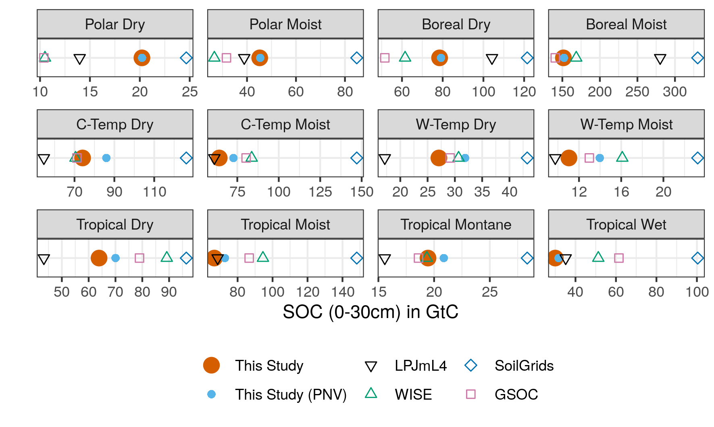
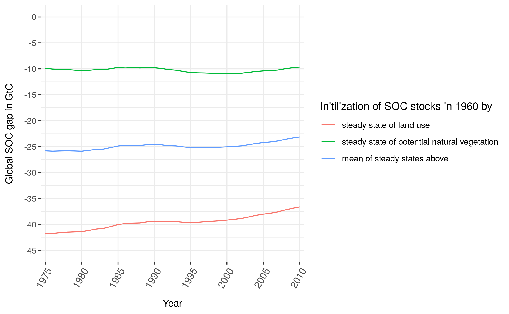

# Appendix

## table on method subsections to functions within R packages {#append:subsection2mrfunctions}


## table on mapping LUH2FAO2MAG {#append:Tableluh2fao2mag}


## kcr2kres mapping {#append:Tablekcr2kres}


## carbon 2 dry matter {#append:Tablec2dm}
Litter is coming from LPJmL in carbon units - transformation with 0.44 is done twice reverting the effect of the transformation 

## closs in AWMS - Table {#append:TableclossAWMS}


## map on climate zone used for SCF {#append:climatemap}


## regional SOC stock in GtC from different sources {#append:regcompare}

```{r captionregSOCtable, echo=FALSE}
captionregSOCtable <- "Modelled as well as data based estimation for global SOC stock in GtC for the first 30 cm of soil aggregated over all land area. Note that SoilGrids, GSOC and WISE do not consider changes over time and rely on soil profile data gather over a long period of time, which makes it hard to pinpoint a specific year to these SOC estimations. In this context they will be compared to modelled data (LPJmL4, this study) for the year 2010."
```

```{r regSOCtable, out.width = "100%", fig.cap = captionregSOCtable, echo=FALSE, fig.pos="h"}
# All defaults

```


## global SOC gap in GtC for different initialization choices {#append:initcompare}

```{r captioninitSOC, echo=FALSE}
captioninitSOC <- "Global SOC gap in GtC for the first 30 cm of soil for different initialization choices."
```

```{r initSOC, out.width = "100%", fig.cap = captioninitSOC, echo=FALSE, fig.pos="h"}
# All defaults

```

## more short comings

- Fertilizer interaction is not included here by accounting for additional N supply that would alter C:N ratio of the carbon inputs. Tier 2 steady-state method is neglecting fertilizer application, however we would have fertilizer amounts at hand to include them, if proper representation of fertilizer within the method would be possible to add.

- Pasture dynamics are neglected and treated as natural vegetation, which might be -- looking on pasture degradation due to overgrazing -- oversimplified for some spots, but is inline with assumption on pasture SOC stocks done before (see Tier 1 IPCC). (Note that also manure excreted to as well as tillage on pastures are neglected within this analysis, since we focus purely on cropland dynamics.)

- Irrigated areas are not crop specific and irrigation is not restricted to growing periods (since it is very complex to calculate average growing periods). Crop specific growing periods might be possible using LPJmL data.

- Flooded rice area are not represented correctly as parametrization does not hold true for flooded conditions.

- Non-net/Gross land use transitions are not tracked in this study.

- Within cropland we do not track croparea transitions, but rather look at statistical distributions of the crop functional types. Due to crop rotations and missing data on crop specific distributions, these transitions would be any way rather uncertain.

- The disaggregation of manure to build-up areas (in the case of extensive monogastrics) is leading to a lot of displaced manure (?) that is cut off

- It is known that there are mismatches between FAO statistics and LUH areas. As far as possibles there were harmonized within this study.
