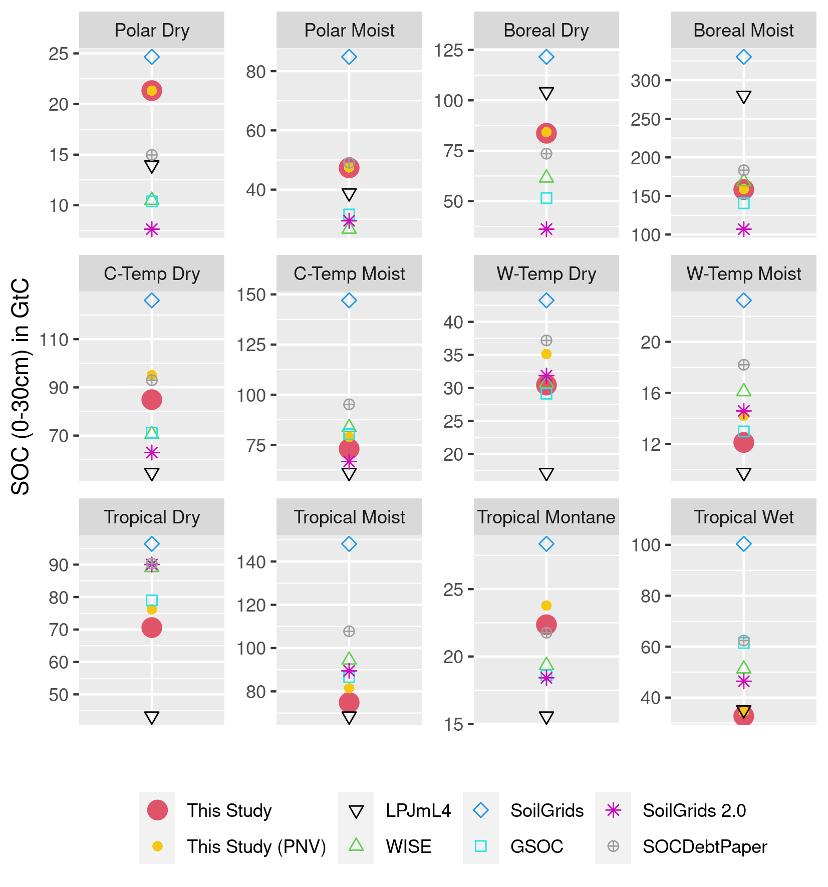

# Appendix

## map on climate zone used for SCF {#append:climatemap}

## carbon 2 dry matter {#append:Tablec2dm}

## closs in AWMS - Table {#append:TableclossAWMS}


## regional SOC stock in GtC from different sources {#append:regcompare}

```{r captionregSOCtable, echo=FALSE}
captionregSOCtable <- "Modelled as well as data based estimation for global SOC stock in GtC for the first 30 cm of soil aggregated over all land area. Note that SoilGrids, GSOC and WISE do not consider changes over time and rely on soil profile data gather over a long period of time, which makes it hard to pinpoint a specific year to these SOC estimations. In this context they will be compared to modelled data (LPJmL4, this study) for the year 2010."
```

```{r regSOCtable, out.width = "100%", fig.cap = captionregSOCtable, echo=FALSE, fig.pos="H"}
# All defaults

```

with 
Canada, Australia and New Zealand: CAZ; 
China: CHA; 
European Union: EUR; 
India: IND; 
Japan: JPN; 
Latin America: LAM;
Middle East and north Africa: MEA; 
non-EU member states: NEU;
other Asia: OAS; reforming countries: REF; Sub-Saharan Africa:
SSA; United States: USA.

## global SOC debt in GtC for various litter parameterizations {#append:senslitterpnv}
