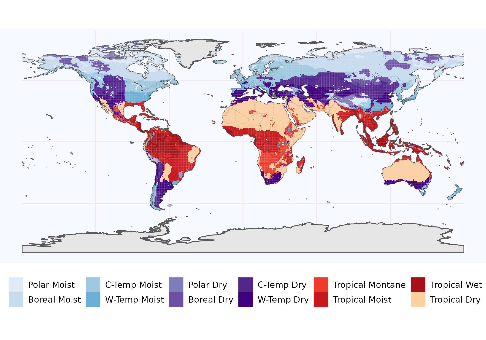

# Appendix

\section{Figures and tables in appendices}

\subsection{Methods}

```{r captionCLIMzone, echo=FALSE}
captionCLIMzone <- "Climate zone map adpated from IPCC: The climate zone classification is based on the classification scheme of the IPCC guidelines ([@eggleston_ipcc_2006]) and has been reimplented by [@carre_background_2010], which is the source of this data. Note that the reduced set, used for the comparison of stock change factors is included in the color code with temperate moist in light blue, temperate dry in dark violett, tropical moist in red and tropical dry in orange."
```

```{r CLIMzone, out.width = "16cm", fig.cap = captionCLIMzone, echo=FALSE}

```

```{=latex}
\begin{table*}[h]
\caption{bla.
}
\begin{tabular}{lllllllllllll}
 \tophline

           &                                 & \multicolumn{3}{l}{Harvested Organs} & \multicolumn{3}{l}{Above-ground Residues} & \multicolumn{2}{l}{Below-ground Residues} & \multicolumn{3}{l}{Allometric coefficients}                \\
Crop code  & Crop Type                       & nr/dm       & wm/dm      & c/dm      & nr/dm         & wm/dm        & c/dm       & nr/dm                & c/dm               & HI\textsuperscript{area} & HI\textsuperscript{prod} & RS   \\
 \middlehline
tece       & Temperate cereals               & 0.0217      & 1.14       & 0.42      & 0.0074        & 1.11         & 0.42       & 0.0098               & 0.38               & 0.58                     & 1.36                     & 0.24 \\
maiz       & Maize                           & 0.016       & 1.14       & 0.42      & 0.0088        & 1.18         & 0.42       & 0.007                & 0.38               & 0.61                     & 1.03                     & 0.22 \\
trce       & Tropical cereals                & 0.0163      & 1.14       & 0.42      & 0.007         & 1.18         & 0.42       & 0.006                & 0.38               & 0.79                     & 1.06                     & 0.22 \\
rice\_pro  & Rice                            & 0.0128      & 1.15       & 0.42      & 0.007         & 1.11         & 0.42       & 0.009                & 0.38               & 2.46                     & 0.95                     & 0.16 \\
soybean    & Soybean                         & 0.0629      & 1.13       & 0.42      & 0.008         & 1.11         & 0.42       & 0.008                & 0.38               & 1.35                     & 0.93                     & 0.19 \\
rapeseed   & Other oil crops (incl rapeseed) & 0.0334      & 1.08       & 0.42      & 0.0081        & 1.11         & 0.42       & 0.0081               & 0.38               & 0                        & 1.86                     & 0.22 \\
groundnut  & Groundnuts                      & 0.0299      & 1.06       & 0.42      & 0.0224        & 1.11         & 0.42       & 0.008                & 0.38               & 1.54                     & 1.07                     & 0.19 \\
sunflower  & Sunflower                       & 0.0216      & 1.08       & 0.42      & 0.008         & 1.11         & 0.42       & 0.008                & 0.38               & 0                        & 1.86                     & 0.22 \\
oilpalm    & Oilpalms                        & 0.0027      & 1.01       & 0.49      & 0.0052        & 1.11         & 0.48       & 0.0053               & 0.47               & 0                        & 1.86                     & 0.24 \\
puls\_pro  & Pulses                          & 0.0421      & 1.1        & 0.42      & 0.0105        & 1.16         & 0.42       & 0.008                & 0.38               & 0.79                     & 0.89                     & 0.19 \\
potato     & Potatoes                        & 0.0144      & 4.55       & 0.42      & 0.0133        & 6.67         & 0.42       & 0.014                & 0.38               & 1.06                     & 0.1                      & 0.2  \\
cassav\_sp & Tropical roots                  & 0.0053      & 2.95       & 0.42      & 0.0101        & 6.67         & 0.42       & 0.014                & 0.38               & 0                        & 0.85                     & 0.2  \\
sugr\_cane & Sugar beet                      & 0.0024      & 3.7        & 0.42      & 0.008         & 3.82         & 0.42       & 0.008                & 0.38               & 0                        & 0.67                     & 0.07 \\
sugr\_beet & Sugar beet                      & 0.0056      & 4.17       & 0.42      & 0.0176        & 5            & 0.42       & 0.014                & 0.38               & 0                        & 0.54                     & 0.2  \\
others     & Fruits, Vegetables, Nuts          & 0.0267      & 5.49       & 0.42      & 0.0081        & 1.88         & 0.42       & 0.007                & 0.38               & 0                        & 0.39                     & 0.22 \\
foddr      & Forage                          & 0.0201      & 4.29       & 0.42      & 0.0192        & 4.1          & 0.42       & 0.0141               & 0.38               & 0                        & 0.28                     & 0.45 \\
cottn\_pro & Cotton seed                     & 0.0365      & 1.09       & 0.42      & 0.0093        & 1.18         & 0.42       & 0.007                & 0.38               & 0                        & 1.48                     & 0.13 \\
\bottomhline
           &                 & \multicolumn{8}{l}{
                                             \begin{minipage}[t]{0.50\columnwidth}
                                                        nr/dm -- nitrogen to dry matter ratio\\
                                                        wm/dm -- wet matter to dry matter ratio\\
                                                        c/dm  -- carbon to dry matter ratio\\
                                                        \end{minipage}} &
                                                                          \multicolumn{3}{l}{
                                                                              \begin{minipage}[t]{0.50\columnwidth}
                                                                                          HI\textsuperscript{area} -- harvest index per area\\
                                                                                          HI\textsuperscript{prod} -- harvest index per production\\
                                                                                          RS -- root:shoot ratio \end{minipage}} 
\end{tabular}
(\#tab:c2dm)
\end{table*}
```

<!-- closs in AWMS - Table {#append:TableclossAWMS} -->

\subsection{Discussion}

```{r captionregSOCtable, echo=FALSE}
captionregSOCtable <- "Modelled as well as data based estimation for climate zone specific SOC stock in GtC for the first 30 cm of soil aggregated over all land area: SoilGrids, GSOC and WISE do not consider changes over time and rely on soil profile data gather over a long period of time, which makes it hard to pinpoint a specific year to these SOC estimations. In this context they will be compared to modelled data (LPJmL4, this study) for the year 2010. PNV denotes the potential natural vegetation state without considering human cropping activities, calculated as reference stock within our model. We use the climate zone specification of the IPCC [eggleston_ipcc_2006]."
```

```{r regSOCtable, out.width = "16cm", fig.cap = captionregSOCtable, echo=FALSE}
# All defaults
knitr::include_graphics("../ResultNotebooks/Output/Images/reg_comparisonfigure.png")
```

```{r captionSOClitter, echo=FALSE}
captionSOClitter <- "Global $\\Delta SOC$ for different litter parameterization choices: Whereas perennial grasses (scenario name \textit{LitterPNV-PerennialGrasses}) are given by the IPCC guidelines ([@calvo_buendia_ipcc_2019]), we used CENTURY configuration file for woody biomass parameterization (see tree.100 in [@century_model_2000]). \textit{LitterPNV-CenturyAverage}) forms the baseline parameterization as used within the study and is calculated as the average over all tree compartments and tree types equally. Litter parameterization has the ability to change global SOC stocks and SOC debt, but is robust concerning trends and sequestration rates."
```

```{r SOClitter, out.width = "16cm", fig.cap = captionSOClitter, echo=FALSE}
# All defaults
knitr::include_graphics("../ResultNotebooks/Output/Images/scenario_litter.png")
```
