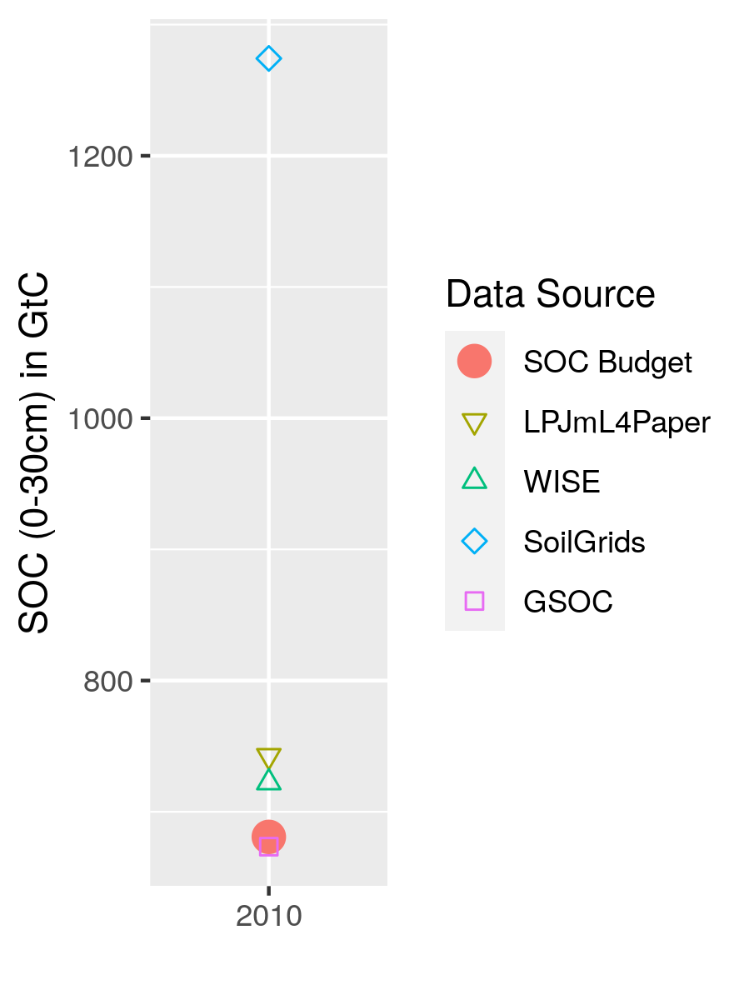

# Discussion

This study shows that spatially explicit and time-variant historical agricultural management data changes estimations of states and trends of global SOC and SOC debt ($\Delta SOC$) considerably compared to the often used constant management assumptions. This result remains robust to variations of central model parameters and variations in the initialization of SOC stocks. While land cover change has depleted SOC stocks and increased the SOC debt, our analysis points out that the high increases in agricultural productivity may have even led to a net reduction of the SOC debt since 1975.

## SOC debt and SOC drivers in literature

The evaluation of SOC stock gains and losses, is complex and has several dimensions as climatic and anthropogenic effects overlap. If defining the SOC debt of 1975 as the baseline, and measuring land-use emissions on croplands as the difference between a potential natural state and the state under human interventions (see [@pugh_simulated_2015]), global croplands have acted as a carbon sink since 1975 according to our study. However, annual C sequesteration rates of 0.2 per mille are well below the promoted 4 per mille ([@minasny_soil_2017]), indicating that productivity gains on historic levels alone are not enough to meet ambitious climate targets. 

According to [@sanderman_soil_2017], the SOC debt since the beginning of human cropping activities has been at around 37 GtC for the first 30 cm of the soil with half of it attributed to SOC depletion on grasslands. Our estimate of 22 GtC in 2010 for cropland debt is higher as [@sanderman_soil_2017] estimations. However, there are large uncertainties in modeling SOC at the global scale, and [@sanderman_soil_2017] pointed out that their results might be conservatively low compared to experimental results. This suggests that our results are within a plausible range.

Furthermore, [@sanderman_soil_2017] modeled historical trends based on agricultural land expansion without considering SOC variations due to time-variant agricultural management. [@pugh_simulated_2015] considered management effects like tillage and residue returning in a static way, but neither changes over time nor alignment to observed historical data like yield-levels or no-tillage areas were taken into account. Their study moreover concludes that crop productivity-gains (increasing yield levels by 18% in their simulations) do not lead to a substantial decline in SOC debt (less than 1% change). Historic productivity increases were, however, notably larger. Despite large spatial heterogeneity aggregate yield increase rates are often estimate well above 50% ([@pellegrini_crop_2018], [@ray_recent_2012], [@rudel_agricultural_2009]).

Our study for the first time uses a dynamic management dataset as driver for SOC dynamics. We show that the moderate global cropland expansion of around 11% between 1974 and 2010 and the resulting depletion of SOC stocks in converted cropland has been outweighed by improvements in agricultural productivity and practices. This is in contrast to [@pugh_simulated_2015] findings of only small effects due to improved practices.

<!--Needed??? Looking on historical cropland intensification rates of above 50% ([@rudel_agricultural_2009]), a large fraction of increased C input from residue biomass, is attributed to productivity improvements. --> 

## Limitations and uncertainties

Modeling management effects at the global scale comes with parametric and structural uncertainties. High SOC gains in the first 30 cm of the soil compared to natural vegetation in e.g. the temperate croplands of Central Europe and the United Kingdom indicate suspiciously high estimates of SOC inputs. As pointed out by [@keel_large_2017] and [@smith_how_2020], carbon input calculations are highly sensitive to the choice of allometric functions determining below- and above-ground residue estimates from harvested quantities (see \@ref(tab:c2dm) for coefficients used in this study). [@keel_large_2017] question whether below ground residues might increase with a fixed root:shoot ratio rather than being independent of productivity gains. Moreover, the study pointed out that plant breeding shifts allometries, which might not be reflected in outdated data sources. While our study considers a dynamic harvest index with rising yields for several crops, we may still overestimate residue biomass in particular for below-ground biomass. However, looking on the evaluation of management effects (see Sect. \@ref(sec:ipcccompare)), there is no general indication of overestimating stock change factors at least compared to IPCC default assumptions. Moreover, it is also likely that we are still missing carbon inputs to the soil from e.g. cover- and inter-cropping practices.

Another uncertainty is connected with the initialization of SOC stocks in 1901, which is assumed to be in steady state considering the land-use pattern of 1901 and agricultural management data of 1965. As shown in Fig. \@ref(fig:SOCinit) the SOC debt estimate almost halves (from ~26 GtC to ~14 GtC), and the SOC debt reduction is strongly reduced (from ~4 GtC to ~2.5 GtC), if considering initialization SOC stocks under undisturbed natural vegetation. [@pugh_simulated_2015] pointed out the importance of accounting for the land-use history, as many CO~2~ emissions from agricultural soils are caused by historic land-use change (LUC) and the slow decline of SOC under cropland before it reaches a new equilibrium. Our results of the Initial-natveg scenario show that the qualitative finding of a reduction of SOC debt through improved agricultural management is robust to changing the initialisation of soil organic carbon, even though the level of SOC debt is sensitive to the initialization setting.

Generally, the limit to the first 30 cm of the soil profile follows the IPCC guidelines ([@eggleston_ipcc_2006], [@calvo_buendia_ipcc_2019]) and assumes that most of the SOC dynamic happens in the topsoil. In this regard several aspects are strongly simplified within our approach. Firstly, distribution of carbon inputs into different soil layers are neglected and all carbon inputs are allocated to the topsoil. This particularly overestimates SOC stocks in the first 30 cm of soil below deeper rooting vegetation, which is certainly the case for most of the woody natural vegetated areas. Secondly changes to the subsoil due to tillage are neglected. As [@powlson_limited_2014] have shown, the subsoil can be a game changer in evaluating total SOC losses or gains for no-tillage systems. No-tillage effects may seem larger than the actually are, if only focusing on the topsoil. SOC transfer to deeper soil layers under tillage, might enhance subsoil SOC compared to no-till practices. Thirdly, organic soils (like peat- and wetlands) and drained cropland areas are not explicitly considered and emissions from these cropland areas are thus likely substantially underestimated. 

This study excludes not only peatland degradation, it also does not account for carbon displacement via leaching and erosion. However, as pointed out by [@doetterl_erosion_2016], the final fate of leached or eroded carbon is uncertain and might even offset LUC emissions ([@wang_human-induced_2017]). Whereas for soil quality analysis SOC displacement might play an important role, in this budget approach focusing especially on the SOC debt, displaced but not emitted SOC can be treated as SOC that remains on the cropland.
Moreover, the exclusive focus on croplands ignores LUC emission on other land-use types such as pastures, rangelands and forestry. Human interventions have led to large changes in SOC stocks there as well ([@sanderman_soil_2017],[@friedlingstein_global_2019]). This study does not intend to be a comprehensive LUC emission analysis and acknowledges that land-use changes comes with large overall emissions.

## Modeled management effect in line with default IPCC assumptions {#sec:ipcccompare}

To validate our modeled SOC stocks and stock changes under management, we compare our results to default IPCC stock changes factors of 2006 ([@eggleston_ipcc_2006] and their refinements in 2019 [@calvo_buendia_ipcc_2019]). Both estimates are based on measurement data for croplands (see Table \@ref(tab:SCFglo)). To allow for comparison, we aggregate our stock change factors to the four IPCC climate zones (Fig. \@ref(fig:CLIMzone)).

```{r SCFglo, echo=FALSE, results = 'asis'}
table <- readRDS("../ResultNotebooks/Output/SFC_comparison.rds")
library(xtable)
print(xtable(table$comparison_table, digit=2, comment=FALSE, label="tab:SCFglo", 
              caption="$F^{\\mathrm{SCF}}$ in comparison to IPCC Tier 1 default factors: Stock change factors are in good agreement with the default values of the IPCC in general. For the tropical regions the assumptions changed notablly from the guidelines in 2006 to the update in 2019. leaving our results in very good agreement with the old default assumptions. Default assumption are given under the assumption of medium input systems, which, considering the yield gap in mainly developing regions in the tropics, might be an overestimation and decrease $F^{\\mathrm{SCF}}$ by additional 5-8 percent. Also modelled $F^{SOC}$ have increased for all climates over time."))
```


Whereas our estimates are lower in the two tropical climate zones, temperate zone default factors are higher than [@calvo_buendia_ipcc_2019]. The tropical factors differ substantially between the IPCC guidelines in 2006 ([@eggleston_ipcc_2006]) and their refinement in 2019 ([@calvo_buendia_ipcc_2019]), with our estimates within this range.
Taking the simplified assumption, that tropical soils might suffer from insufficient C input rates (low) due to yield gaps, whereas temperate soils in developed regions might be highly managed and fertilized (high), the difference vanishes partially. Our results still show  especially in temperate dry regions -- the smallest region area-wise -- small deviations from natural SOC stocks. Considering the impact of irrigation and fertilization on carbon-poor dryland soils, even factors above 1 (see Fig. \@ref(fig:SOCmaps)(c)) may be expected. 

With regard to the time trend, our study shows the substantial impact of changing management factors on the development of $F_{SCF}$ as also indicated by the time trend of the SOC debt.

## SOC stocks in line with literature

The world's SOC stock and its changes are highly uncertain, which is seen in the wide range of global SOC stock estimates for the first 30 cm of the soil profile ([@batjes_harmonized_2016], [@hengl_soilgrids250m_2017], [@fao_global_2018], [@schaphoff_lpjml4_2018-1]) in Table \@ref(fig:SOCglo)).

```{r captionSOCglo, echo=FALSE}
captionSOCglo <- "Modeled as well as data based estimation for global SOC stock in GtC for the first 30 cm of soil aggregated over all land area. Note that SoilGrids, GSOC and WISE do not consider land-use as well as changes over time and rely on soil profile data gather over a long period of time. This makes it hard to pinpoint a specific year for these SOC estimations. In this context they will be compared to modeled data from LPJmL4 for potential natural vegetation and this study for the year 2010."
```

```{r SOCglo, out.width = "8cm", fig.cap = captionSOCglo, echo=FALSE, fig.pos="h"}
# All defaults

```

The global estimates of the total SOC stock from this study are on the lower end compared to other modeled results or data driven estimates. SoilGrids ([@hengl_soilgrids250m_2017]) especially stands out for their high estimation, whereas all other sources (including our study) are comparabely similar. Looking at regional results in Fig. \@ref(fig:SOCreg), our estimates turn out to be in good agreement for most of the world, with the largest deviations for boreal moist and tropical moist areas. To avoid that this bias influences our results, which originates from uncertainties in the representation of natural land, we focus on SOC changes on cropland. Pristine natural vegetated areas (like permafrost and rain forests) without human land management thus drop out in our calculation of $\Delta SOC$ and $F^\mathrm{SCF}$.

Additionally, our estimates for total SOC stocks of the world (as well as our SOC initialization) are dominated by the representation of natural vegetation, which are only estimated in a basic manner. For example, we do not differentiate the parameterization of nitrogen and lignin content of litterfall for woody and grass plant types. This renders carbon inputs and decay dynamics for natural litterfall rather uncertain. The absolute values of SOC stocks and debt from land-use change have to be interpreted with caution. As our default litter parameterization accounts for woody plant types, larger uncertainty in natural land SOC dynamics may arise especially in less forested areas.

We conducted a sensitivity analysis (Fig. \@ref(fig:SOClitter)) based on various plant parameterizations from the Century model (see Sect. \@ref(sec:scenlitterpnv)). This shows that the general trend of decreasing SOC debt of ~4 GtC within the period of 1975--2010 is not altered under various estimates for natural SOC stocks.
