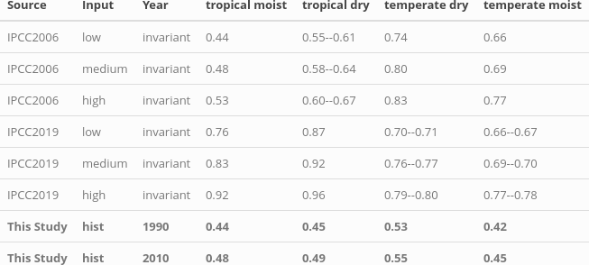
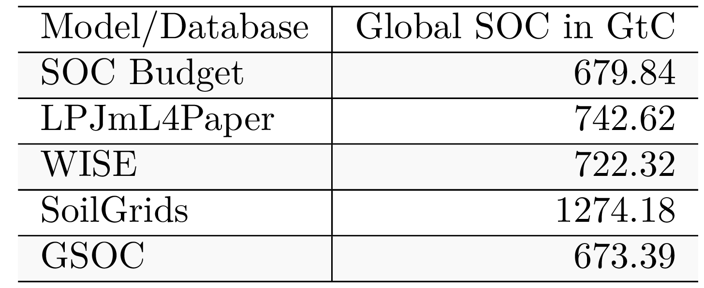

# Discussion

## Including agricultural management data changes the sign of the trend

This study provides an analysis on historic SOC stock changes on cropland. We determine the SOC trends on cropland compared to a potential natural vegeted world under the same historic climatic conditions ($SOC_{natveg}$) leading to a cummulative SOC emission since dawn of mankind of around 37 GtC in 2010. Whereas recent modelling estimates on global SOC emissions indicate an on going increase of SOC emissions (Sanderman et al, Pugh et al.), our study indicates that the global SOC gap might be closing slowly. 

According to Sanderman et al. cummulative SOC emissions since beginning of human cropping activities have been at around 37 GtC for the first 30 cm of the soil with half of it attributed to grazing. It was also pointed out, that this results might be conservative estimates and low compared to experimental results, leaving our estimate of 37 GtC in 2010 for cropland emissions only in alignment with Sanderman et al. estimates considering the hugh uncertainties in modelling SOC on the global scale. 
Furtherore the results of Sanderman et al. calculated historical trends based on agricultural land expansion without considering SOC variations due to different management systems at all. In Pugh et al. management effects like tillage and residue recycling have been considered, but neither changes over time nor alignment to oberserved historical data like yields levels or no tillage areas were taken into account. Under this assumptions this study only found marginal effect of crop productivity and other management effects on cummulative SOC emissions.

Nevertheless our results show, when purely focusing on the past decades, the moderate global cropland expansion of around 11% between 1974 and 2010, is outweighted by improved agricultural yields ad practises. Moreover our sensitivity analysis indicades that 1. yield increases and with that the increase in residue biomass might play the most important role, followed by 2. enhanced residue recycling rates, 3. improved manure recycling (e.g. due to improved animal waste management system) and 4. the adoption of no tillage practises.   

Modelling management effects on the global scale comes however with huge parametic and systematic uncertainties. One aspect pointed out by Keel (2017) as well as by Smith (2019) might be that carbon input calculations are highly sensitive to the choice of allometric functions determining below and above ground residue estimates from harvested quantities. Keel et al. questioned, that below ground residues might increase with a fixed root:shot ratio rather than being independend from productivity gains. Following this argumentation SOC results shown in this study might especially in high-yielding farming system overestimate actual SOC stocks. However according to our study above ground residue biomass recycling seem to contribute even more to overall SOC stocks due to higher input rates.

## Modeled management effect inline with default IPCC assumptions

To validated the effect of our modelled SOC stocks and stock changes under management, we compare our results to default IPCC stock changes factors (cite), which are based on measurement data for croplands (see \@ref(tab:SCFtable)). 

```{r caption_SCFtable, echo=FALSE}
caption_SCFtable <- "This table shows IPCC 2006 as well as 2019 default (medium input) and low input regimes stock change factors $F_{SCF}$ without other subsystem consideration compared results of this study (SOC budget) for 1990 and 2010."
```

```{r SCFtable, out.width = "16cm", fig.cap = caption_SCFtable, echo=FALSE, fig.pos="H"}
# All defaults

```

Our climate zone specific, aggregated $F_{SCF}$ correspond very well to the tier 1 estimation of IPCC, 2006 of $F_{SOC}$. For the tropical regions the assumptions changed notablly from the guidelines in 2006 to the update in 2019, leaving our results too low in comparison with IPCC, 2019. Considering yield gaps in mainly developing regions in the tropics the default assumption of medium input systems, might be an overestimation of actual SOC state. The additional effect of considering low inpout regimes in tropical regions can however not explain the full mismatch to IPCC 2019 values but account for at least 5-7% of it. 


## SOC stocks inline with literature

The worlds SOC stock and its changes are highly uncertain (cite), which is visible by the wide range of global SOC stock estimates (see \@ref(tab:SOCtable)).

```{r caption_SOCtable, echo=FALSE}
caption_SOCtable <- "Modelled as well as data based estimation for global SOC stock (for 2010) in GtC for the first 30 cm of soil."
```

```{r SOCtable, out.width = "8cm", fig.cap = caption_SOCtable, echo=FALSE, fig.pos="H"}
# All defaults

```

The global esimates of SOC stock by this study are on the lower edge compared to other modelled results or more data driven estimates. Looking on regional results (fig. SX in supplement), our estimates turn out to be in good agreement for most regions with the largest deviations for boreal areas. Considering that the model was parametrized for croplands, these mismatches are not superising, since the temperature effects on decomposition is most likly fundamentally different for permaforst soils than assumend in this study. To avoid that this bias influences our results, our study focusses exclusively on cropland soils, excluding most of the boreal zone. Morover, when focussing on SOC changes, pristine natural vegetated areas without human land management under the same historic climatic conditions cancel out in the calculation of SOC emissions. 

However the natural land representation that is dominating the total SOC stocks of the world and with it also the SOC initialization is lacking proper parametrization of nitrogen and lignin content of litterfall. This leaves carbon inputs and decay behaviour for natural land rather uncertained. As all results are valued against these potential natural SOC the absolute values and also the emissions over time have to be used with caution. Especially in less forested areas the natural land representation might be off, due to parameterization assumptions of the natural litterfall. Nevertheless total SOC stocks are in a reasonable range and the stock change factors $F^{SCF}$ are in good agreement with the Tier 1 default values of 2006. In addition we preformed a sensitivity analysis for lignin and nitrogen parameterization of natural litterfall (see appendix). It shows that the general trend of decreasing SOC emissions is not altered even by rather unlikely parameter choices, that would overestimate natural SOC stocks strongly and therefor lead to high emission in the case of land conversion. 


## Important short commings --> move to appendix

Smaller points and shortcommings:

-This study as the IPCC guidelines suggested has limited her focus to the first 30 cm of the soil profile, leaving changes in the subsoil unnoticed. Nevertheless studies (see Don on tillage) have shown, the subsoil to be a game changer in evaluating total SOC losses or gains for no-tillage systems. It has been argued that for intensivly tilled soils, subsoil SOC is increasing due to the import of carbon rich topsoil to deeper soil layers. Following these argumentation SOC stocks in croplands might even be underestimated.

- Fertilizer interaction is not included here by accounting for additional N supply that would alter C:N ratio of the carbon inputs. Tier 2 steady-state method is neglecting fertilizer application, however we would have fertilizer ammounts at hand to include them, if proper representation of fertilizer within the method would be possible to add. 

- Pasture dynamics are neglected and treated as natural vegetation, which might be -- looking on pasture degradation due to overgrazing -- oversimplified for some spots, but is inline with assumption on pasture SOC stocks done before (see Tier 1 IPCC). (Note that also manure excreted to pastures is neglected within these analysis, since we focus purely on cropland dynamics.)

- No tillage adaptaion is neglected on cropland due to less common adoption of no tillage and conservation agriculture. Pastures are assumed to be not tilled at all (propably only heavy managed pastures are tilled with some rotation)

- Irrigated areas are not crop specific and irrigation is not restricted to growing periods (since it is very complex to calculate average growing periods). Crop specific growing periods might be possible using LPJmL data.

- flooded rice area are not represented correctly as parameterization does not hold true for flooded conditions.

- Carbon displacement via leaching and erosion is neglected in this study.

- Non-net/Gross land use transitions are not tracked in this study.

- Within cropland we do not track croparea transitions, but rather look at statistical distributions of the crop functional types. Due to crop rotations and missing data on crop specific distributions, these transitions would be any way rather uncertain.

- The disaggregation of manure to uild-up areas (in the case of extensive monograstrics) is leeding to a lot of displaced manure (?) that is cut off

- It is known that there are mismatches between FAO statistics and LUH areas. As far as possibles there were harmonized within this study.

- "The Tier 2 method does not simulate C change but simply calculates an annual C stock change from the
current C stock to the future steady-state soil C stock calculated based on current conditions." Leading to the fact that our total stock results are highly uncertained.