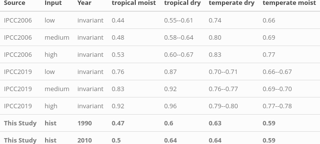

# Discussion

## Including agricultural management data changes the sign of the trend

This study provides an analysis of historic SOC stock changes on cropland. We determine the SOC trends on cropland compared to a counterfactual scenario with a world under natural vegetation under identical historical climatic conditions ($SOC_{natveg}$). Our results show, that human activity lead to cummulative SOC emission of around 37 GtC in 2010. Whereas recent modelling estimates of global SOC emissions indicate an on going increase of SOC emissions (Sanderman et al, Pugh et al.), our study indicates that the global SOC gap is slowly closing due to improved management. 

According to Sanderman et al. cummulative SOC emissions since beginning of human cropping activities have been at around 37 GtC for the first 30 cm of the soil with half of it attributed to grazing. It was also pointed out that these results might be conservatively low compared to experimental results. Considering the huge uncertainties in modelling SOC on the global scale, our estimate of 37 GtC in 2010 for cropland emissions only still seems consistent with Sanderman et al. estimates. 

Furthermore the results of Sanderman et al. modelled historical trends based on agricultural land expansion without considering SOC variations due to different management systems at all. Pugh et al. considered management effects like tillage and residue recycling in a static way, but neither changes over time nor alignment to oberserved historical data like yields-levels or no-tillage areas were taken into account. The study moreover concludes that productivity gains for crops while increasing yield levels by 18%, do not spill over to a substainal decrease in SOC emissions, but only account for less than 1% change in SOC emissions.

Our study for the first time uses a dynanmic management dataset as driver for SOC dynamics. We show that the moderate global cropland expansion of around 11% between 1974 and 2010 and the resulting depletion of SOC stocks in converted cropland has been outweighted by improved agricultural yields and practises. This is challenging Pugh et al. findings of only small effects due to improved pratices.  
Moreover our sensitivity analysis indicades that (1) recycled residue biomass increases driven by higher yields as well as higher higher recycling rates, (2) improved manure recycling (e.g. due to improved animal waste management system) and (3) the adoption of no tillage practises.   

Modelling management effects on the global scale comes however with parametric and structural uncertainties. As pointed out by Keel (2017) and Smith (2019), carbon input calculations are highly sensitive to the choice of allometric functions
determining below and above ground residue estimates from harvested quantities. Keel et al.~questioned whether below ground residues might increase with a fixed root:shoot ratio rather than being independend from productivity gains. Moreover the study pointed out that plant breeding shift allometries and might been not reflected in outdated data sources. Following this argumentation SOC results shown in this study might overestimate actual SOC stocks due to an overestimation in residue biomass, which ratio compared to the harvested organ is normally reduced due to breeding. However, looking into management effect evaluation (see below) there is no indication for a systematic overrating of residue biomass, more likely we are still missing carbon inputs to the soil.

## Modeled management effect in line with default IPCC assumptions

To validate our modelled SOC stocks and stock changes under management, we compare our results to default IPCC stock changes factors (cite) which are based on measurement data for croplands (see \@ref(tab:SCFtable)). To allow for comparison, we aggregated our stock change factors to the four IPCC climate zones. 

```{r captionSCFtable, echo=FALSE}
captionSCFtable <- "This table shows different estimates of stock change factors $F_{SCF}$, defined as the SOC stock of managed croplands relative to the counterfactual SOC stock of undisturbed natural vegetation. We compare average values for four IPCC climate zone classifications. IPCC 2006 and 2019 default factors (medium input) as well as altered factors for low input of organic matter without any other subsystem consideration are compared to results for 1990 and 2010 of this study (SOC budget).}"
```

```{r SCFtable, out.width = "16cm", fig.cap = captionSCFtable, echo=FALSE}
# All defaults

```

Our estimates correspond very well to the default stock-change factors used for the tier 1 estimation of IPCC, 2006. For the tropical regions the assumptions changed notablly from the guidelines in 2006 to the update in 2019, leaving our results too low in comparison with IPCC, 2019. Considering yield gaps in mainly developing regions in the tropics the default assumption of medium input systems, might be an overestimation of actual SOC state. The additional effect of considering low input of biomass in tropical regions can however not explain the full mismatch to IPCC 2019 values but account for at least 5-7% of it. 

Looking again on the time trend our study shows the substantial impact of changed management to the development of $F_{SCF}$.

## SOC stocks inline with literature

The worlds SOC stock and its changes are highly uncertain (cite), which is visible by the wide range of global SOC stock estimates (see \@ref(tab:SOCtable)).

```{r captionSOCtable, echo=FALSE}
captionSOCtable <- "Modelled as well as data based estimation for global SOC stock in GtC for the first 30 cm of soil aggregated over all land area. Note that SoilGrids, GSOC and WISE do not consider changes over time and rely on soil profile data gather over a long period of time, which makes it hard to pinpoint a specific year to these SOC estimations. In this context they will be compared to modelled data (LPJmL4, this study) for the year 2010."
```

```{r SOCtable, out.width = "8cm", fig.cap = captionSOCtable, echo=FALSE, fig.pos="H"}
# All defaults
knitr::include_graphics("../ResultNotebooks/Output/Images/TableSOC_comparison.png")
```

The global esimates of SOC stock by this study are on the lower end compared to other modelled results or more data driven estimates. Looking on regional results (fig. SX in supplement), our estimates turn out to be in good agreement for most regions with the largest deviations for boreal areas. Considering that the model was parametrized for croplands, these mismatches are not superising since the temperature effects on decomposition are fundamentally different for permaforst soils. To avoid that this bias influences our results, our study focusses exclusively on cropland soils, excluding most of the boreal zone. Morover, when focussing on SOC changes, pristine natural vegetated areas without human land management under the same historic climatic conditions cancel out in the calculation of SOC emissions. 

Our estimates for total SOC stocks of the world, as well as our SOC initialization are dominated by the representation of natural lands and pastures, which are however only estimated in a basic manner. For example, we do not have a differentiated parametrization of nitrogen and lignin content of litterfall for woody and grass type biomes. This leaves carbon inputs and decay behaviour for natural land and pastures rather uncertain. The absolute values of stocks and emissions from land-use change therefore have to be used with caution. Especially in less forested areas the natural land representation might be off, due to parameterization assumptions of the natural litterfall.

Nevertheless total SOC stocks are in a reasonable range and results on SOC stock changes in relative or absolute numbers are not altered by pristine vegetaded areas at all. Moreover, the SOC gap from changed management is only affected from the natural vegetation representation in case of land use transitions. Than former natural land SOC stocks are declining to lower levels. However as pointed out before, due to low cropland expansion rates, there SOC declines are outweighted by the general trend of increasing SOC stocks on existing cropland due to management improvements.
We conducted a sensitivity analysis for a wide range of possible parameter combinations for lignin and nitrogen parameterization of natural litterfall, which tend to change the global SOC stock substantially for different choices
(see appendix). It shows that the general trend of decreasing SOC gap is not altered even under very high estimates for natural SOC stocks.


## Important short commings --> move to appendix

Smaller points and shortcommings:

-This study as the IPCC guidelines suggested has limited her focus to the first 30 cm of the soil profile, leaving changes in the subsoil unnoticed. Nevertheless studies (see Don on tillage) have shown, the subsoil to be a game changer in evaluating total SOC losses or gains for no-tillage systems. It has been argued that for intensivly tilled soils, subsoil SOC is increasing due to the import of carbon rich topsoil to deeper soil layers. Following these argumentation SOC stocks in croplands might even be underestimated.

- Fertilizer interaction is not included here by accounting for additional N supply that would alter C:N ratio of the carbon inputs. Tier 2 steady-state method is neglecting fertilizer application, however we would have fertilizer ammounts at hand to include them, if proper representation of fertilizer within the method would be possible to add. 

- Pasture dynamics are neglected and treated as natural vegetation, which might be -- looking on pasture degradation due to overgrazing -- oversimplified for some spots, but is inline with assumption on pasture SOC stocks done before (see Tier 1 IPCC). (Note that also manure excreted to pastures is neglected within these analysis, since we focus purely on cropland dynamics.)

- No tillage adaptaion is neglected on cropland due to less common adoption of no tillage and conservation agriculture. Pastures are assumed to be not tilled at all (propably only heavy managed pastures are tilled with some rotation)

- Irrigated areas are not crop specific and irrigation is not restricted to growing periods (since it is very complex to calculate average growing periods). Crop specific growing periods might be possible using LPJmL data.

- flooded rice area are not represented correctly as parameterization does not hold true for flooded conditions.

- Carbon displacement via leaching and erosion is neglected in this study.

- Non-net/Gross land use transitions are not tracked in this study.

- Within cropland we do not track croparea transitions, but rather look at statistical distributions of the crop functional types. Due to crop rotations and missing data on crop specific distributions, these transitions would be any way rather uncertain.

- The disaggregation of manure to uild-up areas (in the case of extensive monograstrics) is leeding to a lot of displaced manure (?) that is cut off

- It is known that there are mismatches between FAO statistics and LUH areas. As far as possibles there were harmonized within this study.

- "The Tier 2 method does not simulate C change but simply calculates an annual C stock change from the
current C stock to the future steady-state soil C stock calculated based on current conditions." Leading to the fact that our total stock results are highly uncertained.