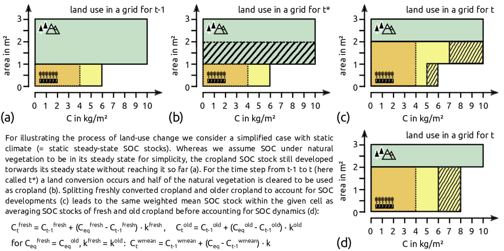

---
output:
  pdf_document: default
  html_document: default
---
# Methods

In Sect. \@ref(sec:carbonbudget) we introduce the basic concept of SOC dynamics as applied in this study and explained in more detail within the refinement of the IPCC guidelines vol. 4 [@calvo_buendia_ipcc_2019]. We additionally describe how we configured and extended the steady-state method (for model code see [@karstens_mrsoil_2020]. In Sect. \@ref(sec:tier1) we shortly refer to the concept of stock change factors as outlined in the Tier 1 approach of the IPCC guidelines [@eggleston_ipcc_2006; @calvo_buendia_ipcc_2019]. 
Section \@ref(sec:agrimanagement) provides a detailed description of the global, gridded management data used to drive the model, including crop production levels, residue input rates, manure amendments, and the adoption of irrigation and tillage practices [for model code see @bodirsky_mrcommons_2020]. In Sect. \@ref(sec:scenarios) we define the scenarios used to complement our historic model results.


## SOC stocks and stock changes following the steady-state method {#sec:carbonbudget}

Following the Tier 2 steady-state approach of the refinement of the IPCC guidelines vol. 4 [@calvo_buendia_ipcc_2019]; referred to as \textit{steady-state method} in the following), we estimate soil organic carbon ($SOC$) stocks and their change over time for cropland at half-degree resolution from 1975 to 2010. We restrict our analysis to the first 0-30 cm of the soil profile. Moreover, we assume the current $SOC$ state converges towards a steady state, which itself depends on biophysical, climatic and agronomic conditions.
Therefore, we take the following three steps for each year of our simulation period: 
(1) We calculate annual land-use type-specific steady states and decay rates for $SOC$ stocks (Sect. \@ref(sec:steadystates)); 
(2) we account for land conversion by transferring $SOC$ from and to natural vegetation (Sect. \@ref(sec:carbontransfer)),
(3) we estimate $SOC$ stocks and changes based on the stocks of the previous time step, the steady state stocks and the decay rate (Sect. \@ref(sec:totalsoc)). 
To initialize the first year of our simulation period we use a spin-up period of 74 years (Sect. \@ref(sec:initsoc)). 


### Steady-state SOC stocks and decay rates {#sec:steadystates}

In a simple first order kinetic approach the steady-state soil organic carbon stocks $SOC^{\mathrm{eq}}$ are given by 
\begin{equation}
SOC^{\mathrm{eq}}_{i,t,sub,lu} =\frac{C^{\mathrm{in}}_{i,t,sub,lu}}{k_{i,t,sub,lu}}
(\#eq:inoutflow)
\end{equation}
with $C^{\textrm{in}}$ being the carbon inputs to the soil, $k$ denotes the soil organic carbon decay rate. This equation is valid for all grid cells $i$ and all years $t$. We use the steady-state method for our calculations, which assumes three soil carbon sub-pools $sub$ (active, slow and passive) and interactions between them, following the approach in the Century model [@parton_analysis_1987]. Annual carbon inflow to each sub-pool and annual decay rates of each sub-pool are land-use type $lu$ specific. 
We distinguish two land-use types: cropland and uncropped land under potential natural vegetation as representative for all other land-use types including forestry and pastures (referred to as natural vegetation in the following). 

Carbon inputs for cropland are below- and above-ground residues left or returned to the field (see Sect. \@ref(sec:residues)) and manure inputs (see Sect. \@ref(sec:livstmanure)); for natural vegetation litterfall including fine root turnover [@schaphoff_lpjml4_2018] is the only source of carbon inflow to the soil. Following the IPCC guidelines [@calvo_buendia_ipcc_2019], carbon inputs are disaggregated into metabolic and structural components depending on their lignin and nitrogen content. For each component the sum of all carbon input sources is allocated to the respective $SOC$ sub-pools via transfer coefficients. This implies that both the amount of carbon and its structural composition determine the effective inflow into the different pools. Data sources for all considered carbon inputs as well as for lignin and nitrogen content are listed in Table \@ref(tab:datasourceinputs).

  ```{=latex}
    \begin{table*}[h]
    \caption{Type and data sources for carbon inputs and parameterization to different land-use types }
    \begin{tabular}{p{0.15\textwidth} p{0.20\textwidth} p{0.20\textwidth} p{0.35\textwidth}}
    \tophline
    \textbf{land-use types}   & \textbf{source of carbon inputs} & \textbf{data source} & \textbf{nitrogen and lignin content} \\
    \middlehline
    \multirow{3}{*}{Cropland} & above-ground residues, & \multirow{3}{*}{\begin{minipage}[t]{0.35\columnwidth}\raggedright
                                                                        \citet{faostat_faostat_2016}, \\
                                                                        \citet{schaphoff_lpjml4_2018},\\
                                                                        \citet{weindl_livestock_2017} \end{minipage}} & 
                                                        \multirow{3}{*}{\begin{minipage}[t]{0.35\columnwidth}\raggedright
                                                                        LG:C generic values according to Table 5.5B,\\
                                                                        5.5C from IPCC \citep{calvo_buendia_ipcc_2019},\\
                                                                        crop-specific N:C from \citet{bodirsky_n2o_2012}
                                                                        \end{minipage}} \\
                              & below-ground residues, &  &  \\
                              & manure                &  &  \\ 
                              \hline
    Natural vegetation        & annual litterfall &  \citet{schaphoff_lpjml4_2018}
                              & \begin{minipage}[t]{0.35\columnwidth}\raggedright\strut 
                                  IPCC \citep{calvo_buendia_ipcc_2019} and\\ 
                                  CENTURY (\citep{century_model_2000}) \strut \end{minipage}\tabularnewline
   \bottomhline
   \end{tabular}
   \label{tab:datasourceinputs}
   \belowtable{}
   \end{table*}
```
   
The sub-pool specific decay rates $k_{sub}$ are influenced by climatic conditions, biophysical and biochemical soil properties as well as management factors that all vary over space ($i$) and time ($t$). Following the steady-state method [@calvo_buendia_ipcc_2019], we consider temperature ($temp$), water ($wat$), sand fraction ($sf$) and tillage ($till$) effects to account for spatial variation of decay rates. Thus, $k_{sub}$ are given by

\begin{equation}
\begin{aligned}
& k_{i,t,\mathrm{active},lu}  & = &~ k_{\mathrm{active}}  ~ &\cdot~ temp_{i,t} ~ &\cdot~ wat_{i,t,lu} ~ &\cdot~ till_{i,t,lu} ~ & \cdot~ sf_{i}\\
& k_{i,t,\mathrm{slow},lu}    & = &~ k_{\mathrm{slow}}    ~ &\cdot~ temp_{i,t} ~ &\cdot~ wat_{i,t,lu} ~ &\cdot~ till_{i,t,lu} ~ &\\
& k_{i,t,\mathrm{passive},lu} & = &~ k_{\mathrm{passive}} ~ &\cdot~ temp_{i,t} ~ &\cdot~ wat_{i,t,lu} ~ & ~ & 
(\#eq:decayrates)
\end{aligned}.
\end{equation}

For natural vegetation, we assume rainfed and non-tilled conditions, whereas for cropland, we distinguish the effect of different tillage (see Sect. \@ref(sec:tillage)) and irrigation (see Sect. \@ref(sec:irrigation)) practices on decay rates. We calculated area weighted means for $till$ and $wat$ on cropland for each grid cell, using area shares for the different tillage and irrigation pratices. Data sources as well as used parameters for the different decay drivers for all land-use types are listed in Table \@ref(tab:datasourcedecay); equations are displayed by equation 5.0B--5.0F in Calvo Buendia et al. [-@calvo_buendia_ipcc_2019]. 

```{=latex}

 \begin{table*}[h]
 \caption{Type and data sources for carbon inputs to different land-use types}
 \begin{tabular}{l l l l}
 \tophline
  land-use types   & type of decay driver & parameter use to represent driver & data source \\
 \middlehline
 \multirow{2}{*}{all} & Soil quality & Sand fraction of the first 0-30 cm 
                                     & \citet{hengl_soilgrids250m_2017} \\
                      \cline{2-4}
                      
                      & Mircobial activity & air temperature & \citet{harris_version_2020} \\
                      \cline{2-4}
                      
                      & Water restriction & precipitation \& potential evapotranspiration & \citet{harris_version_2020} \\
                      \cline{1-4}
\multirow{2}{*}{\begin{minipage}[t]{0.2\columnwidth}\raggedright\strut Cropland\\(additionally)\strut\end{minipage}} & Water restriction*  & irrigation  & Sect. @ref(sec:irrigation) \\ 
                      \cline{2-4}
                      
                      & Soil disturbance & tillage & Sect. @ref(sec:irrigation) \\
 \bottomhline
 \end{tabular}
 \belowtable{}
 (\#tab:datasourcedecay)
 \end{table*}
```

### SOC transfer between land-use types {#sec:carbontransfer}


```{r captionLUtrans, echo=FALSE}
captionLUtrans <- "Scheme of land-use transition representation for a simplified case.."
```

```{r LUtrans, out.width = "16cm", fig.cap = captionLUtrans, echo=FALSE, fig.pos="h"}
# All defaults

```

We calculate $SOC$ stocks based on the area shares of land-use types ($lu$) within our grid cells ($i$). If land is converted from one land-use type $lu=\{crop,natveg\}$ into the other $!lu=\{natveg,crop\}$, a respective share of the $SOC$ is reallocated within our budget. As we do not distinguish between newly converted and old cropland (see \@ref(fig:lutransitions)), we update the average SOC stock per area within this modeling step. We account for land conversion at the beginning of each time step $t$ by calculating a preliminary stock $SOC_{t^*}$ via 

\begin{equation}
SOC_{i,t^*,sub,lu} = SOC_{i,t-1,sub,lu} - \frac{SOC_{i,t-1,sub,lu}}{A_{i,t-1,lu}} \cdot  AR_{i,t,lu} + \frac{SOC_{i,t-1,sub,!lu}}{A_{i,t-1,!lu}} \cdot  AE_{i,t,lu}
(\#eq:ctransfer)
\end{equation}

with $A_{lu}$ being the land-use type specific areas, $AR_{lu}$ the area reduction and $AE_{lu}$ the area expansion of the two land-use types. Data sources and methodology on land-use states and changes are described in Sect. \@ref(sec:landuse). 

### Total SOC stocks and stock changes {#sec:totalsoc}

$SOC$ converge towards the calculated steady-state stock $SOC^{\mathrm{eq}}$ for each grid cell $i$, each annual time step $t$, each land-use type $lu$ and each sub-pool $sub$ like

\begin{equation}
SOC_{i,t,sub,lu} = SOC_{i,t^*,sub,lu} + (SOC^{\mathrm{eq}}_{i,t,sub,lu} - SOC_{i,t^*,sub,lu}) \cdot k_{i,t,sub,lu} \cdot 1\unit{a}.
(\#eq:SOCstate)
\end{equation}

Note that the decay rates have to be multiplied by one year ($1a$) to form a dimensionless factor.
Reformulating this equation, we obtain a mass balance equation as follows

\begin{equation}
SOC_{i,t,sub,lu} = SOC_{i,t^*,sub,lu} - \underbrace{SOC_{i,t^*,sub,lu} \cdot k_{i,t,sub,lu} \cdot 1\unit{a}}_{\text{outflow}} + \overbrace{SOC^{\mathrm{eq}}_{i,t,sub,lu} \cdot k_{i,t,sub,lu} \cdot 1\unit{a}}^{\text{input (using equation (1))}}.
(\#eq:steadystate2budget)
\end{equation}

The global $SOC$ stock for each time step $t$ can then be calculated via

\begin{equation}
SOC_{t} = \sum_{i} \underbrace{\sum_{lu} \overbrace{\sum_{sub} SOC_{i,t,sub,lu}}^{\text{$SOC_{i,t,lu}$ -- land-use type specific SOC stock within cell}}}_{\text{$SOC_{i,t}$ -- total SOC stock within cell}}.
(\#eq:totalstock)
\end{equation}

According to the IPCC guidelines $SOC$ changes can be expressed as the difference of two consecutive years [see Eq. 5.0A in @calvo_buendia_ipcc_2019]. This, however, will also include naturally occurring changes due to climatic variation over time. For our study, we defined the absolute and relative SOC changes in relation to a potential natural state $SOC^{\mathrm{pnv}}$ under the same climatic conditions in grid cell $i$ at time $t$, that is based on the natural vegetation $SOC$ calculations as defined above without accounting for land conversion from cropland at any time. The absolute changes $\Delta SOC$ and relative changes $F^{\mathrm{SCF}}$ are thus given by 

\begin{equation}
\Delta SOC_{i,t} = SOC_{i,t} - SOC^{\mathrm{pnv}}_{i,t}\qquad \text{and} \qquad  F^{\mathrm{SCF}}_{i,t} = \frac{SOC_{i,t}}{SOC^{\mathrm{pnv}}_{i,t}} .
(\#eq:stockdiff)
\end{equation}

Note that the absolute changes $\Delta SOC$ can be also interpreted as the SOC debt [@sanderman_soil_2017] due to human cropping activities; whereas relative changes $F^{\mathrm{SCF}}$ can be considered stock change factors as defined within the IPCC guidelines of 2006 [@eggleston_ipcc_2006]. Moreover, $\Delta SOC$ is equivalent to the negated cumulative SOC component of human land-use change emissions [@pugh_simulated_2015].

### Initialization of SOC pools {#sec:initsoc}

We initialize our SOC sub-pools using a three-step approach, since input data availability is limited for climate and litter (from 1901) as well as for agricultural management data (from 1965):

Firstly, to account for the impacts of legacy fluxes from land-use changes long before the time horizon of interest, we account for land-use change from 1510. We repeat climate and subsequently also litter input data from 1901-1930 to simulate a constant climate for this first initializing period. Agricultural management data is hold constant at the level of 1965. In 1510 we assume all SOC pools to be in natural steady-state, implicating that all land-use change emissions prior to that time, are redistributed to 1510. Due to this long first spin-up period we suppose that the effect of this late accounting and appertaining delayed legacy fluxes can be neglected in 1901. This approaches follows others studies looking on effects of land-use change and management (cite LPJmL (which?)).   

Secondly, to account for the impact of a changing climate, we account not only for land-use change, but also for historical climate and consequently natural litter inputs to the soil, from 1901 to 1965 still considering constant agricultural input data.

Thirdly, we run the model for additional 10 years with historic dynamic input data and start analyzing results from 1975 onward. This is in line with IPCC method suggestion to have a 5-20 year spin-up period. 

Irrigation areas are part of the water effect associated with the climate data set and therefore dynamic from 1901 on, whereas data on no-tillage areas is only available after 1974. 

<!-- backup
```{=latex}
 \begin{table*}[h]
 \caption{Setup of spin-up and simulation phase}
 \begin{tabular}{l l l}
 \tophline
 \multirow{3}{*}{1901--1964} 
   & Constant management spin-up phase with
   & historic land-use change (LUH2v2), climate (CRU4p2) and litter inputs (LPJmL4)
   & constant management data from 1965 (manure and residue inputs, tillage and irrigation areas)\\
                      \cline{1-4}
 \multirow{3}{*}{1965--1974}
   & Dynamic management spin-up phase with
   & historic land-use change (LUH2v2), climate (CRU4p2) and litter inputs (LPJmL4)
   & historic management data (manure and residue inputs, tillage and irrigation areas)
                      \cline{1-4}
 \multirow{3 }{*}{1975--2010}                     
   & Simulation phase 
   & historic land-use change (LUH2v2), climate (CRU4p2) and litter inputs (LPJmL4)
   & historic management data (manure and residue inputs, tillage and irrigation areas)              
 \bottomhline
 \end{tabular}
 \belowtable{}
 (\#tab:datasourcedecay)
 \end{table*}
``` -->
## SOC stocks and stock changes following Tier 1 {#sec:tier1}

Additionally to the steady-state method [@calvo_buendia_ipcc_2019] and the detailed analysis of management data coming with it, SOC changes can be estimated using the IPCC Tier 1 approach of IPCC guidelines [@eggleston_ipcc_2006; @calvo_buendia_ipcc_2019]. Here, stocks are calculated via stock change factors ($F^{\mathrm{SCF}}$) given by the IPCC for the topsoil (0-30 cm) and based on observational data. Estimates of $F^{\mathrm{SCF}}$ are differentiated by different crops, management and input systems (here summarized under $m$) reflecting different dynamics under changed in- and outflows without explicitly tracking these. Moreover, estimates of $F^{\mathrm{SCF}}$ vary for different climatic zones ($c$) specified by the IPCC (see Fig. \@ref(fig:CLIMzone)). The actual $SOC$ stocks are thus calculated based on a given reference stock $SOC^{\mathrm{ref}}$ by

\begin{equation}
SOC_{i,t} = \sum_{c,m} T_{c,i} \cdot SOC^{\mathrm{ref}}_{i,t} \cdot F^{\mathrm{SCF}}_{c,m}
(\#eq:tier1)
\end{equation}

with $T_{c,i}$ being the translation matrix for grid cells $i$ into corresponding climate zones $c$. For this analysis, we use the default $F^{\mathrm{SCF}}$ from the Tier 1 method of Eggleston et al. [-@eggleston_ipcc_2006] and Calvo Buendia et al. [-@calvo_buendia_ipcc_2019] as a comparison and consistency check for our more detailed Tier 2 steady-state approach.

## Agricultural management data at 0.5 degree resolution {#sec:agrimanagement}

We compile country-specific FAO production and cropland statistics [@faostat_faostat_2016] to a harmonized and consistent data set. The data is prepared in 5-year time steps from 1965 to 2010, which restricts our analysis to the time span from 1975 to 2010 (after a spin-up phase from 1901-1974). For all the following data, if not declared differently, we interpolate values linearly between the time steps and keep them constant before 1965.

### Land use and land-use change {#sec:landuse}

Land-use patterns are based on the Land-Use Harmonization 2 [@hurtt_harmonization_2020] data set, which we sum up from quarter-degree to half-degree resolution. We disaggregate the physical area of the five different cropland subcategories (c3ann, c3per, c4ann, c4per, c3nfx) of LUH2 into our 17 crop groups [see FAO2LUH2MAG_croptypes.csv in @bodirsky_mrcommons_2020], applying the relative shares for each grid cell based on the country- and year-specific area harvested shares of FAOSTAT data [@faostat_faostat_2016]. By calculating country-specific multicropping factors using FAOSTAT data, we are able to compute crop-group specific area harvested on grid cell level. 
Land-use transitions are calculated as net area differences of the land-use data at half-degree resolution, considering no split up into crop-group specific areas but only total cropland and natural vegetation areas.

### Crop and crop residues production {#sec:residues}

Crop production patterns are compiled crop group specific using half-degree yield data from LPJmL [@schaphoff_lpjml4_2018] as well as half-degree cropland patterns (see Sect. \@ref(sec:landuse)). We calibrate cellular yields with a country-level calibration factor for each crop group to meet historic FAOSTAT production [@faostat_faostat_2016]. By using physical cropland areas in combination with harvested areas, we account for multiple cropping systems as well as for fallow land. 

Crop residue production and management is based on a revised methodology of Bodirsky et al. [-@bodirsky_n2o_2012] and key aspects are explained here given its central role for soil carbon modeling. Starting from crop yield estimates ($Y$) and respective harvested crop area ($CA$), we estimate above-ground ($AGR$) and below-ground ($BGR$) residual biomass using crop group ($cg$) specific ratios for above-ground residues to harvested biomass ($r^{\mathrm{ag,prod}}_{cg}$ in $\tfrac{\unit{tC}}{\unit{tC}}$), above-ground residues to harvested area ($r^{\mathrm{ag,area}}_{cg}$ in $\tfrac{\unit{tC}}{\unit{ha}}$) and below-ground residues to above-ground biomass ($r^{\mathrm{bg}}_{cg}$ in $\tfrac{\unit{tC}}{\unit{tC}}$) as follows

\begin{equation}
\begin{aligned}
AGR_{i,t,cg} & = CA_{i,t,cg} \cdot \left( Y_{i,t,cg} \cdot  r^{\mathrm{ag,prod}}_{cg}+  r^{\mathrm{ag,area}}_{cg} \right)
\qquad & \textrm{and} \\
BGR_{i,t,cg} & = (CP_{i,t,cg} + AGR_{i,t,cg}) \cdot r^{\mathrm{bg}}_{cg} \qquad                                            & \forall\quad cg, i, t.
(\#eq:resbiomass)
\end{aligned}
\end{equation}

Following the IPCC guidelines, we split the above-ground residue calculations into a production ($r^{\mathrm{ag,prod}}$) and an area dependent ($r^{\mathrm{ag,area}}$) fraction [@hergoualch_n2o_in_ipcc_2019]. Deviating from Bodirsky et al. [-@bodirsky_n2o_2012] we use harvested instead of physical crop area to account for increased residue biomass due to multiple cropping and decreased residue amounts due to fallow land. We assume that all $BGR$ are left in the soil, whereas $AGR$ can be burned or harvested for other purposes such as feeding animals [@weindl_livestock_2017], fuel or for material use. 

A country-specific fixed share of the $AGR$ is assumed to be burned on field depending on the per-capita income of the country. Following Smil [-@smil_nitrogen_1999] we assume a burn share of $25\%$ for low-income countries according to World Bank definitions ($<\,1000\,\tfrac{USD}{yr\,cap}$), 15% for high-income  ($>\,10000\,\tfrac{USD}{yr\,cap}$) and linearly interpolate shares for all middle-income countries depending on their per-capita income. Depending on the crop group, 80–90% of the carbon in the crop residues burned in the fields is lost within the combustion process [@eggleston_ipcc_2006].  

From our 17 crop groups, we compile four residue groups (straw, high- and low-lignin residues, residues without dual use), of which the first three are taken away from the field for other purposes (see mappingCrop2Residue.csv in Bodirsky et al. [-@bodirsky_mrcommons_2020]. Residue feed demand for five different livestock groups is based on country-specific feed baskets [see @weindl_livestock_2017], that differentiate between the residue groups and take available $AGR$ biomass as well as livestock productivity into account. We estimate a material-use share for the straw-residue group of 5% and a fuel-share of 10% for all used residue groups in low-income countries. For high-income countries, no withdrawal for material or fuel use is assumed, and use shares of middle-income countries are linearly interpolated based on per-capita income, following the same rationale as for the share of burnt residues described above. The remaining $AGR$ as well as all $BGR$ are expected to be left on the field. We limit high residue return rates to at most $10\unit{tC\,ha}^{-1}$ in order to correct for outliers. 

To transform dry matter estimates into carbon and nitrogen, we compiled crop-group and plant-part specific carbon resp. nitrogen to dry matter (c/dm, n/dm) ratios (see \@ref(tab:c2dm)).


### Livestock distribution and manure excretion {#sec:livstmanure}

Manure especially from ruminants is often excreted at pastures and rangelands, but due to the intensification of livestock systems 	at the present day a lot of the manure has to be stored and can be applied on croplands. We assume that manure application happens at its excretion place, so that the livestock distribution is the driving factor of the spatial pattern of manuring.

To disaggregate country level FAOSTAT livestock production data to half-degree resolution, we use the following rule-based assumptions, drawing from the approach of Robinson et al. [-@robinson_mapping_2014] and applying feed basket assumptions based on a revised methodology from Weindl et al. [-@weindl_livestock_2017]. We differentiate between ruminant and monogastric systems, as well as extensive and intensive systems.
Due to great feed demand of ruminants, we assume that ruminant livestock is located where the production of feed occurs to minimize transport of feed. We distinguish between grazed pasture, which is converted into livestock products in extensive systems, and primary-crop feed stuff, which we consider to be consumed in intensive systems.
For poultry, egg and monogastric meat production we use the per-capita income of the country to distinguish between intensive and extensive production systems. For low-income countries, we assume only extensive production systems. We locate them according to the share of built-up areas based on the assumption that these animals are held in subsistence or small-holder farming systems with a high labor-per-animal ratio. Intensive production associated with high-income countries, is distributed within a country using the share of primary-crop production, assuming that feed availability is the most determining factor for livestock location. For middle-income countries we split the livestock production into extensive and intensive systems based on the per-capita income. 

Manure production and management is based on a revised methodology of Bodirsky et al. [-@bodirsky_n2o_2012] and is presented here due to its central role in soil carbon modeling. Based on the gridded livestock distribution we calculate spatially explicit excretion by estimating the nitrogen balance of the livestock systems on the basis of comprehensive livestock feed baskets [@weindl_livestock_2017], assuming that all nitrogen in protein feed intake, minus the nitrogen in the slaughter mass, is excreted. Carbon in excreted manure is estimated by applying fixed C:N ratios, which range from 10 for poultry up to 19 for beef cattle (for full detail see Calvo Buendia et al. [-@calvo_buendia_ipcc_2019]. 
Depending on the feed system we assume manure to be handled in four different ways:
All manure originated from pasture feed intake is excreted directly on pastures and rangelands (pasture grazing), deducting manure collected as fuel.
Whereas for low-income countries, we adopt a share of 25% of crop residues in feed intake directly consumed and excreted on crop fields (stubble grazing), we do not consider any stubble grazing in high-income countries; middle-income countries see linearly interpolated shares depending on their per-capita income.
For all other feed items, we assume the manure to be stored in animal waste management systems associated with livestock housing. 
To estimate the carbon actually returned to the soil, we account for carbon losses during storage, where return shares depend on different animal waste management and grazing systems. Whereas we assume no losses for pasture and stubble grazing, we consider that the manure collected as fuel is not returned to the fields. For manure stored in different animal waste management systems we compiled carbon loss rates (see calcClossConfinement.R in Bodirsky et al. [-@bodirsky_mrcommons_2020] for more details) depending on the different systems and the associated nitrogen loss rates as specified in Bodirsky et al. [-@bodirsky_n2o_2012]. We limit high application shares at $10\unit{tC\,ha}^{-1}$ to correct for outliers.

### Irrigation {#sec:irrigation}

The LUH2v2 [@hurtt_harmonization_2020] data set provides irrigated fractions for their cropland subcategories. We sum up irrigation area shares for all crop groups within a grid cell, and calculate the water effect coefficient $wat$ on decay rates using these shares to compute the weighted mean between rainfed and irrigated $wat$ factors. As a result $wat$ is the same for all crop groups within a grid cell. Furthermore, we suppose the irrigation effect to be present for all 12 months of a year in a grid cell including irrigated areas, since we do not have consistent crop group specific growing periods available. This will lead to an overestimation of the irrigation effect. We expect, however, water limitations to be a minor problem during the off-season in temperature limited cropping regions, causing our assumption to not dramatically overestimate the moisture effects. In tropical, water-limited cropping areas, irrigated growing periods might even span over the whole year.

### Tillage {#sec:tillage}

In order to derive a spatial distribution of the three different tillage types specified by the IPCC --- full tillage, reduced tillage and no tillage ---, we assume that all natural land and pastures are not tilled, whereas annual crops are under full and perennials under reduced tillage per default. Furthermore, we assume no tillage in cropland cells specified as no tillage cell based on the historic global gridded tillage data set from Porwollik et al. [-@porwollik_generating_2018]. This data set is extended to the period of 1975--2010 by combining country-level data on areas under conservation agriculture from FAO [-@fao_aquastat_2016] and half-degree resolution physical crop areas from Hurtt et al. [-@hurtt_harmonization_2020], applying the methodology of Prowollik et al. [-@porwollik_generating_2018] to identify potential no-tillage grid cells. 


## Scenario definitions {#sec:scenarios}

To highlight the impact of changing management effects and to assess the sensitivity of the model towards different initialization and parameter choices, we perform a set of scenario runs. In the following sections we outline name and idea of these scenarios [for technical implementation see @karstens_mrsoil_2020].

### Management scenarios {#sec:scen_management}

To single out the impact of tillage practices, residue and manure inputs, we defined scenario with constant values for these three drivers: In the \textit{constTillage} scenario the adoption of no-tillage practices are neglected (adoption starts in 1974 according to the available data set). The \textit{constResidues} and the \textit{constManure} scenario assume constant input rates from residues resp. manure (in $\unit{t ha^{-1}}$) at the level of 1975 onward. Within the \textit{constResidue} scenario at different effects overlay each other: yields and with them residue biomass increase due to productivity gains; rates of residue left or returned to fields are raising; and shifts of cropping pattern change the amount of residue biomass due to crop-group specific harvest index values. The \textit{constManagement} combines all three scenarios \textit{constTillage}, \textit{constResidues} and \textit{constManure}.

