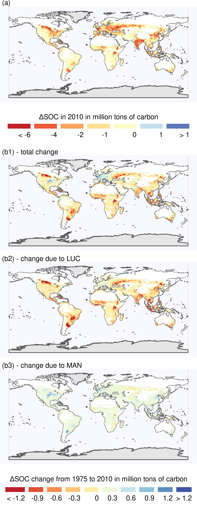
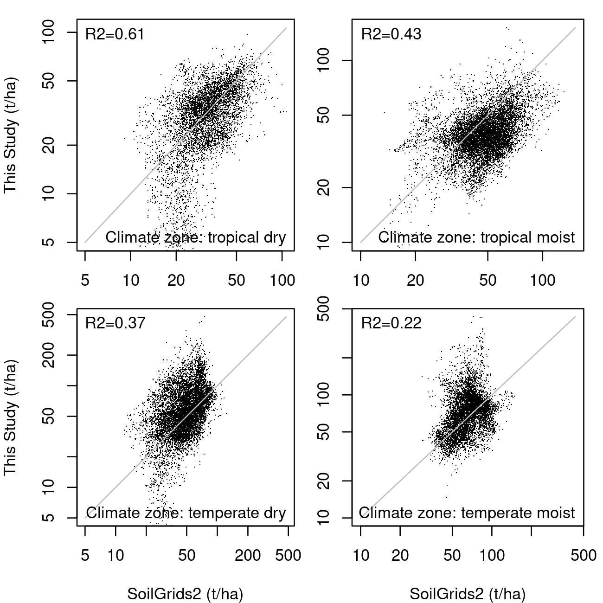
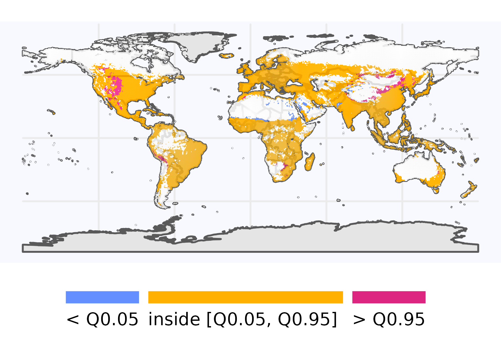

# Results

Detailed results for the spatially explicit global SOC budget including intermediate results on input data from manure and residues as well as SOC stock results for all scenario runs can be found in the data repository from Karstens [-@karstens_model_2020]. In the following, the most important results [see @karstens_result_2020 for post-processing scripts] are summarized.

## SOC distribution and depletion

```{r captionSOCmaps, echo=FALSE}
captionSOCmaps <- "Global SOC stocks and SOC stock changes on cropland for the first 30 cm of the soil profile considering historical management data. Panel (a) shows global $\\Delta SOC$ between historical land use and potential natural vegetation (PNV). The distribution of total global SOC stocks for the first 30 cm on cropland for the year 2010 is depcited in panel (b). Absolute (c) and relative (d) SOC stocks changes for the year 2010 are compared to a potential natural state identify different hotspots of SOC losses and gains."
```

```{r SOCmaps, out.width = "18cm", fig.cap = captionSOCmaps, echo=FALSE, fig.pos="h"}
# All defaults
knitr::include_graphics("../ResultNotebooks/Output/Images/4panelfigure.png")
```

The global SOC debt has increased by about 14% in the period between 1975 and 2010 from $34.6$ to $39.6\,\unit{GtC}$ (Fig. \@ref(fig:SOCmaps)(a)). This corresponds to an average loss rate of $0.14\,\unit{GtC\,yr^{-1}}$ in comparison to a hypothetical potential natural vegetation (PNV) state. Considering our estimate of the global SOC stock of around $705\,\unit{GtC}$ in the upper $30\,\unit{cm}$ in 1975, global SOC decreased by 0.2 per 1000 per year for the period between 1975 and 2010 in comparison to the PNV state. The speed of this SOC loss has decreased towards the end of the modeling period.
Note that the SOC stock itself --- without comparing it to a a PNV state --- increases during the period between 1975 and 2010 from $705\,\unit{GtC}$ to $712\,\unit{GtC}$, which corresponds to overall SOC stock increase of $0.2\,\unit{GtC\,yr^{-1}}$.

In Fig. \@ref(fig:SOCmaps)(b) we provide a world map of SOC stocks estimates for the first $30\,\unit{cm}$ on cropland considering historical management data for the year 2010. Values range between over $100\,\unit{t\,ha^{-1}}$ in northern temperate cropland to less than $5\,\unit{t\,ha^{-1}}$ for arid and semiarid cropland.
Our spatially explicit results show hotspots of SOC losses and gains compared to SOC under PNV in two complementary ways: 
1. Absolute SOC changes $\Delta SOC$ (Fig. \@ref(fig:SOCmaps)(c)) indicate areas with high importance for the global $SOC$ loss. They can be driven by large relative changes (e.g. in Central Africa) or by a high natural stock, from which even small relative deviations could lead to substantial absolute losses (e.g. North-East Asia). 
2. Relative SOC changes measured as stock changes factors $F^{SCF}$ (Fig. \@ref(fig:SOCmaps)(d)) are a helpful metric to analyze the impact of human cropping activities. They indicate areas with large differences in carbon inflows or SOC decay compared to natural vegetation, that may hold potential to be overcome by improved agricultural practices. Large parts of tropical cropland seem to suffer from strongly reduced relative stocks, indicating SOC degradation. Conversely, irrigated cropland at the border to dry, unsuitable areas worldwide shows a strong relative increase in SOC stocks.

```{r captionSOCdebt, echo=FALSE}
captionSOCdebt <- "Global total $\\Delta SOC$ and $\\Delta SOC$ change for the first 30 cm of the soil profile. Panel (a) shows global $\\Delta SOC$ as the difference between $SOC$ under historical land use and $SOC$ under potential natural vegetation (PNV) in the year 2010 summed over all land-use types. Computing the difference between the $\\Delta SOC$ estimate for 2010 and for 1975 (b1) depicts areas of SOC depletion (SOC debt increase, red) and SOC accumulation (SOC debt decline, blue). Panel (b2) shows the of land-use change (LUC) induced change of ∆SOC between 1975 and 2010, whereas panel (b3) depicts the change due to changing agricultural management (MAN)."
```

```{r SOCdebt, out.width = "9cm", fig.cap = captionSOCdebt, echo=FALSE, fig.pos="h"}
# All defaults

```
The spatial distribution of the total $\Delta SOC$ summed over all land-use types (Fig. \@ref(fig:SOCdebt)(a))  and its change from 1975 to 2010 (Fig. \@ref(fig:SOCdebt)(b1)) reveals areas of SOC debt decline and increase. 
Regions with large cropland expansion (e.g. Brazil, Southeast Asia, Canada) continue to lose SOC, whereas regions with cropland reduction (and thus SOC restoration) or with accumulating cropland SOC can be found e.g. in highly productive areas of Europe and Central USA.  


## Carbon flows in the cropland system

```{r caption_FlowFig, echo=FALSE}
caption_FlowFig <- "Global carbon flows within the cropland system for the year 2010 (in $\\unit{MtC}$). Carbon is first photosynthesised by crop plants and then used for livestock feed and various other usages subsumed under human demand. After accounting for losses within the cropland system, there are three major C inputs to cropland SOC: manure, above- and below-ground residues. Large parts of C, however, are mineralized on the field before entering the soil. Additionally, C is transferred to and from global cropland soil stock via land-use change between cropland and natural vegetation. Finally, SOC is mineralized and flows back to the atmosphere."
```

```{r FlowFig, out.width = "16cm", fig.cap = caption_FlowFig, echo=FALSE, fig.pos="h"}
# All defaults
knitr::include_graphics("../ResultNotebooks/Output/Images/CarbonBudget.png")
```

C is removed from the atmosphere via plant growth and allocated to different plant parts, which we aggregate to three pools (harvested organ, above- and below-ground residues). Whereas harvested organs as well as above ground-residues are taken (partially) from the field to be used for other purposes, below-ground residues ($729\,\unit{MtC}$ in 2010) are directly returned to the field. We divide crop biomass usage into feed usage and aggregate all other usage types (e.g. food, bioenergy and material) into a human demand category. Livestock feed demand for crop organ harvest and above-ground residues of $1136\,\unit{MtC}$ is roughly equal to the human demand of $1129\,\unit{MtC}$. Whereas large parts of feed intake are returned to the soils via manure (C input from manure at $384\,\unit{MtC}$), we assume the carbon demanded from humans (ending up as e.g. compost, night soil and sewage) is not returned to soils. Besides manure C and below-ground residues, above-ground residues form the largest C input to the soil with $1350\,\unit{MtC}$ returned to the fields in the year 2010. However, around 60% of this organic C decomposes before it is integrated into soils. Due to the different composition of organic C, proportionally more C enters the slow pool from manure than from crop residue. 
According to our model results, land-use change dynamics led to a C transfer from natural vegetation to cropland of $257\,\unit{MtC}$ in 2010. The cropland system receives $4585\,\unit{MtC}$ assimilated by crop plants and releases $3554\,\unit{MtC}$ mostly through respiration. Accounting for SOC transfer and decomposition, the net SOC decrease of global cropland is around $33\,\unit{MtC}$ for the year 2010.

## Agricultural management effects on SOC debt

```{r captionSOCscen, echo=FALSE}
captionSOCscen <- "(a) Global $\\Delta SOC$ in $\\unit{GtC}$ for different management scenarios. The stylized scenarios deviate from historical agricultural management patterns (histManagement) by holding effects of carbon inflows from residues (constResidues) or manure (constManure) constant at the 1975 level, or neglecting adoption of no-tillage practices over time (constTillage). The scenario constManagement combines all three modifications. Note that $\\Delta SOC$ is defined as the difference of SOC under land-use compared to a hypothetical natural vegetation state. Panel (b) shows the carbon inflows from crop residue and manure."
```

```{r SOCscen, out.width="14cm", fig.cap = captionSOCscen, echo=FALSE, fig.pos="h"}
# All defaults
knitr::include_graphics("../ResultNotebooks/Output/Images/scenario_horiz.png")
```

We analyze the relative impact of different management practices by comparing the actual historical management scenario with counterfactual scenarios, where individual management practices (residues in constResidues, manure in constManure, tillage practices in constTillage, all three in constManagement) are kept static at the 1975 values (Figure \@ref(fig:SOCscen)(a)). As shown by the difference between the constResidues scenario and the other counterfactuals, changes in residue return rates dominate the management effects. Without the historical increase in C inputs from residues to agricultural soils, the global $\Delta SOC$ would decrease to $41.7\,\unit{GtC}$ at a rate of $0.20\,\unit{GtC\,yr^{-1}}$ --- a 35% increase compared to $0.14\,\unit{GtC\,yr^{-1}}$ for the histManagement estimates. Both the constManure and constTillage scenarios show only small deviations from the historical agricultural management values with $0.15\,\unit{GtC\,yr^{-1}}$. The effect of no-tillage only becomes discernible from 2000 onwards. 
The large contribution of residues relative to manure also becomes visible when considering the annual C inputs of residues and manure to soils over a period of 35 years (Fig. \@ref(fig:SOCscen)(b)).

Using the constManagement results, that only include land-use change (LUC) related changes of the SOC debt between 1975 and 2010, we are able to subtract the LUC effect from the overall SOC debt change within the histManagement results. The remaining effect can be attributed to the changing agricultural management (MAN) as other drivers such as climatic effects have been already canceled out by taking the difference to a PNV reference state while calculating $\Delta SOC$. 
The increasing SOC debt on global cropland are primarily caused by LUC (red areas in Fig. \@ref(fig:SOCdebt)(b2)). Deteriorated management also contributed to increasing SOC debt in parts of Sub-saharan Africa and Central Asia. In contrast, agricultural management has led to an decrease in SOC debt in the USA, Europe, as well as in parts of China and India (blue areas in Fig. \@ref(fig:SOCdebt)(b3)), which is not visible in the total $\Delta SOC$ change as LUC was happening at the same time.

Our sensitivity analysis shows that the management impact is robust to the initialization of SOC stocks (see Fig. \@ref(fig:SOCinit) and Sect. \@ref(sec:scenarios)) with around $2.15\,\unit{GtC}$ difference in SOC debt between the histManagement and the constManagement scenario. However, the SOC debt and SOC debt change varies with the different initialization choices. Whereas the default assumption (Initial-spinup1510) shows a $\Delta SOC$ of $39.6\,\unit{GtC}$ for the year 2010, the Initial-natveg scenario with high legacy fluxes to come only has a $\Delta SOC$ of $33.3\,\unit{GtC}$ and the Initial-eq scenarios with only little legacy fluxes left already a $\Delta SOC$ of $50.7\,\unit{GtC}$.

## Model evaluation {#sec:validate}

To evaluate our model results against reference data in five steps: (1) we compare our stock change factors (see Sect. \@ref(sec:tier1)) to IPCC default assumptions [@lasco_cropland_in_ipcc_2006; @ogle_cropland_in_ipcc_2019]; (2) we compare our global (and climate-zone specific) total SOC stocks to other literature estimates; (3) we compare our results to point measurements. To evaluate the representation of our natural SOC stocks (4) we correlated LPJmL4 SOC stocks for PNV with our natural state SOC results on grid level; and (5) we do a similar correlation analysis for our modeled actual SOC stocks in comparison to the results of SoilGrids 2.0 [@poggio_soilgrids_2021], which accounts for actual land use too.

### Stock change factors compared to IPCC assumptions {#sec:ipcccompare}

To evaluate our modeled SOC stocks and stock changes under agricultural management, we compare our results to the default IPCC stock change factors $F^{\mathrm{SCF}}$ of 2006 [@lasco_cropland_in_ipcc_2006] and their refinements in 2019 [@ogle_cropland_in_ipcc_2019]. Both estimates are based on measurement data for cropland (see Table \@ref(tab:SCFglo)). To allow for comparison, we aggregate our stock change factors weighted by grid-level cropland area to derive average factors for the four IPCC climate zones (Fig. \@ref(fig:CLIMzone)). Note that IPCC Tier 1 factors are derived under the assumption that there is a linear change between steady states over 20 years, whereas our aggregated factors just reflect the relative change compared to a given potential natural vegetation reference stock without specifically tracking the time scale of the stock change. 

```{r SCFglo, echo=FALSE, results = 'asis'}
table <- readRDS("../ResultNotebooks/Output/SFC_comparison.rds")
library(xtable)
print(xtable(table$comparison_table, digit=2, label="tab:SCFglo",
              caption="$F^{\\mathrm{SCF}}$ in comparison to IPCC Tier 1 default factors from the guidelines in 2006 \\citep{lasco_cropland_in_ipcc_2006} and the update in 2019 \\citep{ogle_cropland_in_ipcc_2019}."), comment=FALSE, caption.placement = "top")
```
Stock change factors for temperate climate zones of this study are lower than the default values of the IPCC. For the tropical regions the IPCC factors increased notably from the guidelines in 2006 [@lasco_cropland_in_ipcc_2006] to the update in 2019 [@ogle_cropland_in_ipcc_2019] due to the inclusion of more data points. Our results are in good agreement with the 2006 IPCC factors. Modeled $F^{SCF}$ have increased or stayed constant for all climate zones over time (1975-2010).

### Global SOC stocks comparison

We compare our global SOC stocks with a wide range of global SOC stock estimates for the first 30 cm of the soil profile, using data from WISE [@batjes_harmonized_2016], SoilGrids [@hengl_soilgrids250m_2017], GSOC [@fao_global_2018], LPJmL4 [@schaphoff_lpjml4_2018-1], SoilGrids 2.0 [@poggio_soilgrids_2021], and SOCDebtPaper [@sanderman_soil_2017] in Fig. \@ref(fig:SOCglo).

```{r captionSOCglo, echo=FALSE}
captionSOCglo <- "Modeled as well as observation-based estimates for global SOC stock in $\\unit{GtC}$ for the first 30 cm of soil aggregated over all land area. The comparison against observation-based data (SoilGrids, SoilGrids 2.0, GSOC and WISE) is supplemented by modeled data from LPJmL4 \\citep{schaphoff_lpjml4_2018-1} and estimates from \\citep{sanderman_soil_2017}. We show values of this study for the year 2010 accounting for the historical land-use dynamics as well as for an hypothetical PNV."
```

```{r SOCglo, out.width = "11cm", fig.cap = captionSOCglo, echo=FALSE, fig.pos="h"}
# All defaults
knitr::include_graphics("../ResultNotebooks/Output/Images/glo_comparisonfigure.png")
```

The global estimates of the total SOC stock of the upper 30 cm from this study are in the middle of the wide range of other modeled or observation-based estimates. Regional results (Fig. \@ref(fig:SOCreg)) show that our estimates are well within the range of other estimates for most regions, but at the lower end for tropical moist and tropical wet areas. SoilGrids [@hengl_soilgrids250m_2017] especially stands out with its high estimate, since they include the litter horizon on top of the soil, that might dominate especially polar and boreal soils. SoilGrids 2.0 [@poggio_soilgrids_2021] however, excludes litter C and thus marks the lower end for particularly northern regions. For the same reason it is also more comparable to our results, which do not account for litter C as well. 

### Point-based evaluation

In Fig. \@ref(fig:SOCpoint) we correlate our SOC results for natural vegetation and cropland in 2010 with literature values from point measurements [for data base see appendix of @sanderman_soil_2017]. The goodness of the fit is very low with an $R^2$ of $0.13$. Individually the correlations are even lower with a $R^2$ of $0.09$ for cropland and $0.08$ for areas of natural vegetation. This point to the fact that differences between land-use type SOC stocks could be better matched than the spatial pattern of the rather small point measurement data base. 
Due to the low number of small-scale measurements, statistical properties of the point data variability are not derived and thus, could not be used to improve the point-to-grid-cell comparison [see @rammig_generic_2018]. 

### Natural SOC stock comparison with LPJmL4

Estimates of SOC stocks under natural vegetation influence our modeled results for cropland, which has been converted from natural vegetation at some point in time. As the Tier 2 modeling approach [@ogle_cropland_in_ipcc_2019] is not specifically parameterized for natural vegetation it is important to evaluate its suitability to produce reasonable results in that domain as well at least comparable to other modeling approaches.
We therefore also compare our modeled results for SOC under natural vegetation (derived using litterfall of LPJmL4) against estimates of SOC by LPJmL4 for a PNV simulation (see Fig.\@ref(fig:SOCLPJmL4)). Both models are driven by the same climate conditions and the same natural litterfall and just differ in the representation of SOC and litter dynamics. With our focus on cropland SOC dynamics, we compare only cells with more than $1000\,\unit{ha}$ of cropland (capturing 99.9% of global cropland area).
Spatial correlations of PNV SOC stock values are high (global $R2=0.81$), especially for dry climate zones (Fig. \@ref(fig:SOCLPJmL4)). For temperate and tropical moist areas estimates of this study tend to be a bit lower compared to LPJmL4 results.

### Actual SOC stock comparison with SoilGrids 2.0

SoilGrids 2.0 [@poggio_soilgrids_2021] is a digital soil mapping approach that uses over 240 000 soil profile observations to produce high resolution soil maps including SOC stocks and estimates of their uncertainties. To evaluate the performance of our model at the global scale, we correlate SoilGrids 2.0 SOC stock values, which were aggregated to 0.5 degree resolution, to our estimates for the year 2010 in Fig. \@ref(fig:SOCSoilGrids2). To focus our comparison on cropland areas, we mask out grid cells with less than $1000\,\unit{ha}$ of cropland. Spatial correlation is moderate for tropical climate zones, whereas it is low for temperate moist areas. In tropical dry and temperate dry areas, we simulate also very low SOC values (below $10\,\unit{tC\,ha^{-1}}$), which is not found in SoilGrids 2.0 whereas our modeled SOC stocks can be substantially higher in temperate moist areas than reported by SoilGrids 2.0. 
Additionally, we use the uncertainty estimates from SoilGrids 2.0 in Fig. \@ref(fig:SOCSoilGrids2Q) to identify areas, where our modeled SOC stocks that are below the 5th or above the 95th percentile of the SoilGrids 2.0 data. 
For the vast majority of grid cells our model results are between the 5th and 95th percentile of SoilGrids 2.0 estimates. We underestimate SOC stocks especially in dry areas (e.g. close to the Sahara). Overestimated stocks are often situated in mountainous regions.

```{r captionSOCSoilGrids2, echo=FALSE}
captionSOCSoilGrids2 <- "Correlation between modeled SOC stocks of this study and projected values from SoilGrids 2.0."
```

```{r SOCSoilGrids2, out.width = "13cm", fig.cap = captionSOCSoilGrids2, echo=FALSE, fig.pos="h"}
# All defaults

```


```{r captionSOCSoilGrids2Q, echo=FALSE}
captionSOCSoilGrids2Q <- "Global map on SOC results compared to uncertainty estimates from SoilGrids 2.0."
```

```{r SOCSoilGrids2Q, out.width = "14cm", fig.cap = captionSOCSoilGrids2Q, echo=FALSE, fig.pos="h"}
# All defaults

```

