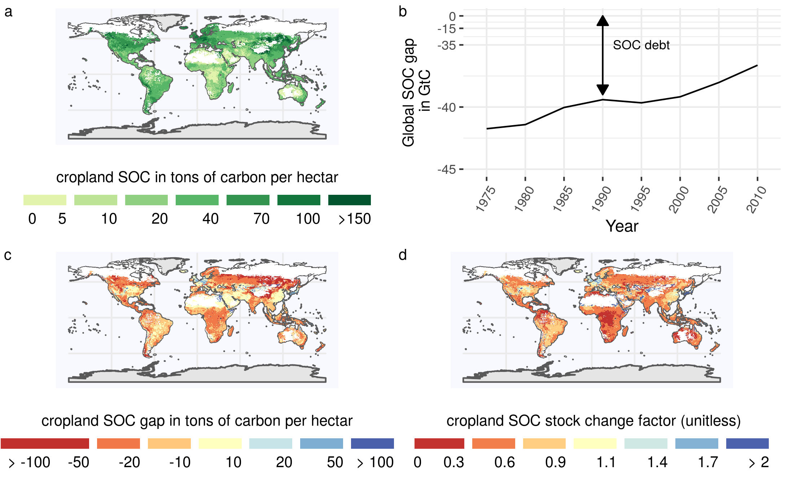
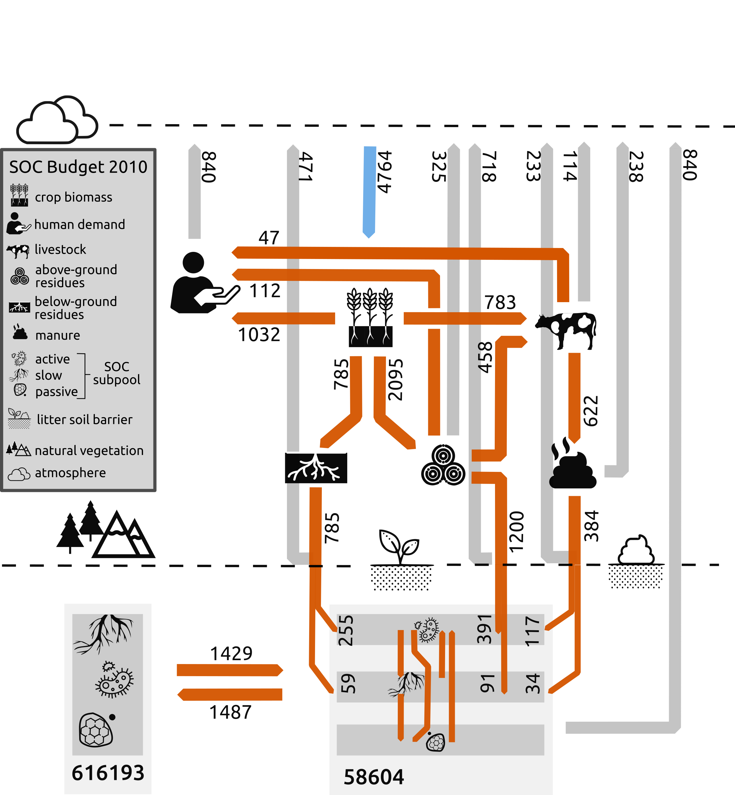
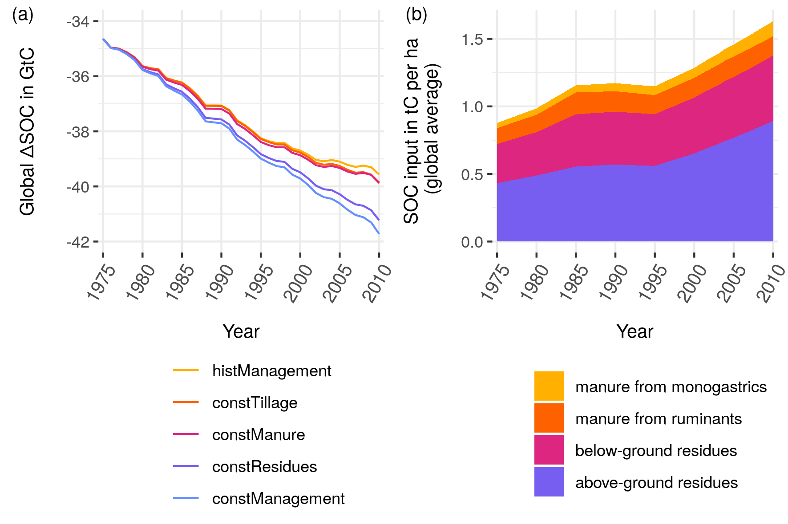
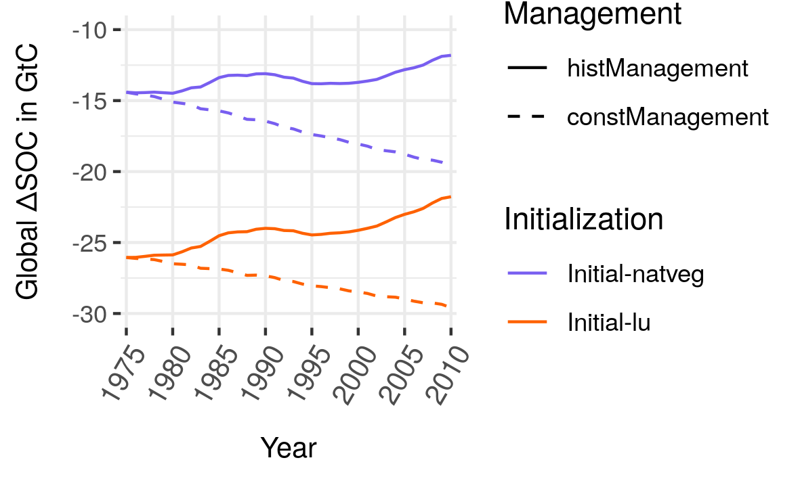

# Results

Detailed results for the spatially explicit global SOC budget including intermediate results on input data as well as SOC stock results for all scenario runs can be found in Karstens [-@karstens_model_2020]. In the following, the most important results [see @karstens_result_2020] for post-processing script) are summarized.

## SOC distribution and depletion

```{r captionSOCmaps, echo=FALSE}
captionSOCmaps <- "(a): Distribution of total global SOC stocks for the first 30 cm on cropland:  Carbon stocks are large in high yielding areas. (b)+(c): Absolute (b) and relative (c) SOC stocks changes compared to a potential natural state identify different hotspots of SOC dynamics. Whereas absolute losses $\\Delta SOC$ are often highest in temperate dry regions, relative losses $F^\\mathrm{SCF}$ are often larger in tropical moist areas. (d): $\\Delta SOC$ between SOC under historic land use and potential natural vegetation is decreasing over time, meaning net SOC gains on global croplands over the the period 1975--2010. "
```

```{r SOCmaps, out.width = "18cm", fig.cap = captionSOCmaps, echo=FALSE, fig.pos="h"}
# All defaults

```

In Fig. \@ref(fig:SOCmaps)(a) we provide the first world map of SOC stocks for the first 30 cm on croplands considering historic management data at the global scale for the year 2010. Values ranging between well over $100\unit{t ha^{-1}}$ in northern temperate croplands to less than $5\unit{t ha^{-1}}$ for arid and semiarid croplands. 
Our spatially explicit results show hotspots of SOC losses and gains compared to SOC under potential natural vegetation in two complementary ways: 
1. Absolute SOC changes $\Delta SOC$ (see Fig. \@ref(fig:SOCmaps)(b)) indicate areas with high importance for the global SOC losses. They might be driven by large relative changes (e.g. in Central Africa) or by a high natural stock, from which even small relative deviations could lead to substantial absolute losses (e.g. North-East Asia). In contrast, large net gains of SOC occur primarily in developed countries of the Global North according to our results. 
2. Relative SOC changes measured as stock changes factors $F^{SCF}$ (see Fig. \@ref(fig:SOCmaps)(c)) are a helpful metric to analyze the impact of human cropping activities. They indicate areas with large differences in carbon inflows or SOC decay compared to natural vegetation, that may hold potential to be overcome due to improved agricultural practices. Large parts of tropical croplands seem to suffer from low stock changes factors, meaning high relative SOC losses and maybe indicating SOC degradation. Conversely, not only temperate croplands of Central Europe, Japan and western areas of the USA have high stock change factors, but irrigated croplands at the border to dry, unsuitable areas worldwide as well.

The global SOC debt has decreased by about 15% in the period between 1975 and 2010 to $22\unit{GtC}$ (Fig. \@ref(fig:SOCmaps)(d)). This corresponds to a sequestration rate of $0.11\unit{GtC yr^{-1}}$. Considering our estimate of the global SOC stock of around $660\unit{GtC}$ in 1975, global SOC increased by 0.2 per 1000 per year for the period between 1975--2010. 

## Carbon flows in the agricultural system

```{r caption_FlowFig, echo=FALSE}
caption_FlowFig <- "Global carbon flows within the agricultural system for the year 2010 (in MtC): Carbon is first photosynthesise by crop plants and than used depending on the plant part by humans for feed of livestock and various other usages subsumed under human demand. After accounting for losses within the agricultural system three major C inputs are applied to croplands: manure, above- and below-ground residues. Large parts of C, however, get mineralized on field before entering the soil. Additionally, C is transferred to and from agricultural soils via land-use change to and from natural vegetation. Finally, SOC gets mineralized and flows back into the atmosphere."
```

```{r FlowFig, out.width = "16cm", fig.cap = caption_FlowFig, echo=FALSE, fig.pos="h"}
# All defaults

```

C is sequestered from the atmosphere via plant growth and allocated to three different plant parts (harvest organ, above- and below-ground residues). Whereas harvested organs as well as above ground-residues are taken (partially) from the field to be used for other purposes, below-ground residues (785 MtC in 2010) are directly returned to the field. We split up usage for crop biomass into feed usage and aggregate all other usage types (e.g. like food, bioenergy and material) into a human demand category. Livestock feed demand for crop harvest and above-ground residues of 1141 MtC is almost equal to the human demand of 1144 MtC. Whereas large parts of feed intake are recycled to the soils via manure (C input from manure at 384 MtC), we assume the carbon demanded from humans (ending up as e.g. compost, night soil and sewage) is not recycled to soils. Besides manure C and below-ground residues, above-ground residues form the largest C input to the soil with 1200 MtC returned to the field in 2010. However, around 60% of C decomposes before its integrated into soils at the the litter-soil barrier. Due to the different C composition, proportional more C enters the slow pool from manure compared to crop residue. According to our model results, land-use change dynamics led to a C transfer from cropland to natural vegetation of 58 MtC in 2010. 4764 MtC sequestered by crop plants face 3897 MtC released within the agricultural system. Accounting for SOC transfer, SOC increase under cropland is around 809 MtC.


## Agricultural management effects on SOC debt

```{r captionSOCscen, echo=FALSE}
captionSOCscen <- "(a) Global $\\Delta SOC$ in GtC for different management scenarios: The stylized scenarios devate from historic argicultural management by holding effects of carbon inflows from residues (constResidues), manure (constManure) constant or neglecting adoption of no-tillage practices (constTillage). ConstManagement combines all three modifications. Note that $\\Delta SOC$ is defined as the difference of SOC under land-use compared to a natural vegetation state. Figure (b) shows the carbon inflows from crop residue and manure, underlining the strong impact of residues for SOC stock and SOC stock changes."
```

```{r SOCscen, out.width="14cm", fig.cap = captionSOCscen, echo=FALSE, fig.pos="h"}
# All defaults

```

We analyze the relative impact of individual management aspects by comparing the actual historic management scenario with counterfactual scenarios where individual management aspects are kept static at the 1975 values (Figure \@ref(fig:SOCscen)(a)). Without changes in management regimes, the global $\Delta SOC$ on cropland would be increasing at a rate of $0.1\unit{GtC yr^{-1}}$. As shown by the constResidue scenario, changes in residue return rates dominate the management effects. Without the historic increase in residue returning, the global $\Delta SOC$ would still increase at a rate of $0.06\unit{GtC yr^{-1}}$. Both the constManure and constTillage scenarios show only small deviations from the historic values (sequestration rate of $0.09\unit{GtC yr^{-1}}$ for both). The effect of no-tillage has been particuarly strong since the 1990s. 
The strong impact of almost doubling C inputs from crop residue biomass over a period of 35 years on agricultural SOC stocks is shown in Fig. \@ref(fig:SOCscen)(b).

```{r captionSOCinit, echo=FALSE}
captionSOCinit <- "Global $\\Delta SOC$ for different SOC initialization choices in the start year 1901: Starting the spin-up phase with natural steady-state SOC under vegetation without any human cropping activities (Initial-natveg) lead to a smaller $\\Delta SOC$ in 1975 and a less steeper increase till 2010, as compared to initialzing with steady-state SOC stocks under historic land-use."
```

```{r SOCinit, out.width="10cm", fig.cap = captionSOCinit, echo=FALSE, fig.pos="h"}
# All defaults

```

Our sensitivity analysis shows that the management impact is robust to the initialization of SOC stocks at the beginning of the spin-up phase (Fig. \@ref(fig:SOCinit)). The Initial-natveg scenario initializes the start year with the steady-state SOC under potential natural vegetation for all land-use types, compared to the default assumption (Initial-lu), which assumes landuse-type specific steady-state SOC stocks in 1901. The $\Delta SOC$ estimation almost halves (from ~26 GtC to ~14 GtC), as does the decrease in $\Delta SOC$ for the period of 1975--2010 (from ~4 GtC to ~2.5 GtC) for the Inital-natveg scenario.
 
Global SOC stocks range between 645--700 GtC for different parameterization of the natural litterfall, whereas $\Delta SOC$ vary  19-24 GtC for the year 2010 (see Fig. \@ref(fig:SOClitter). The increase of $\Delta SOC$ during the period of 1975--2010 is independent of the parameterization choice at ~4 GtC. 

