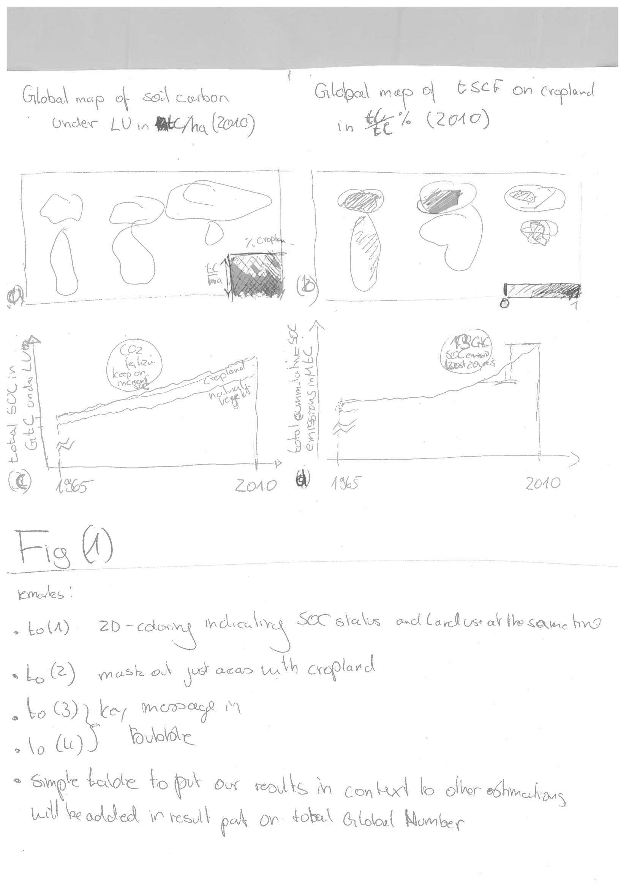
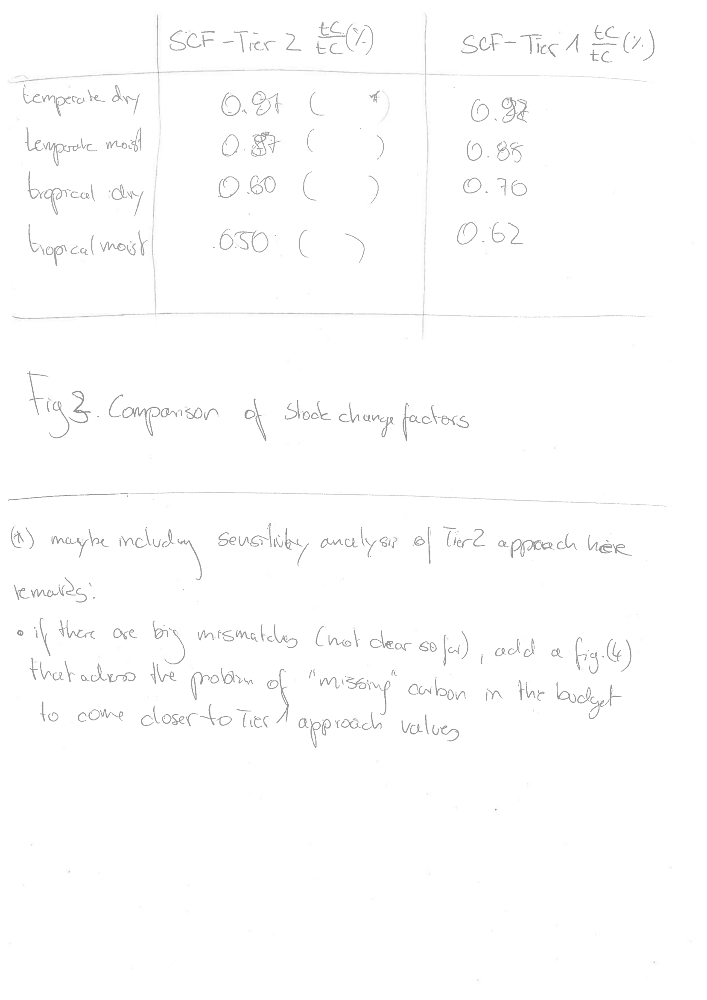
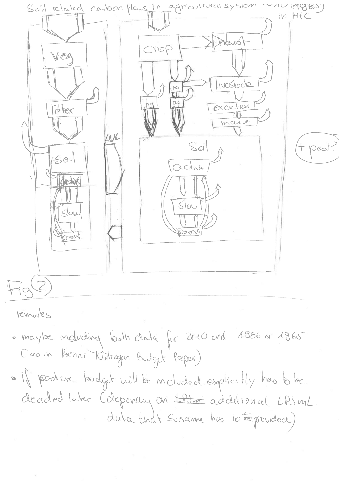
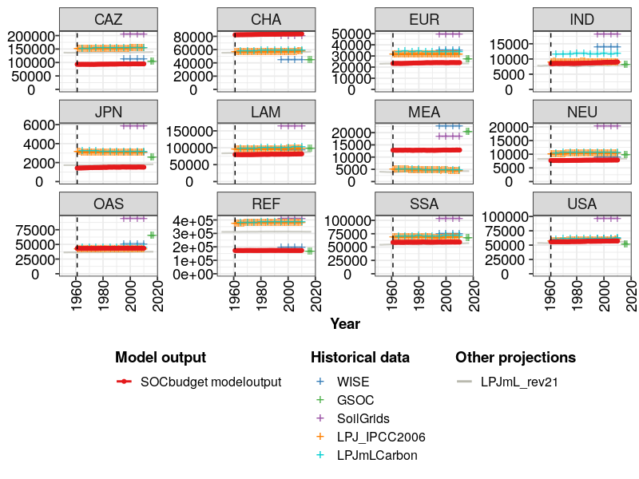
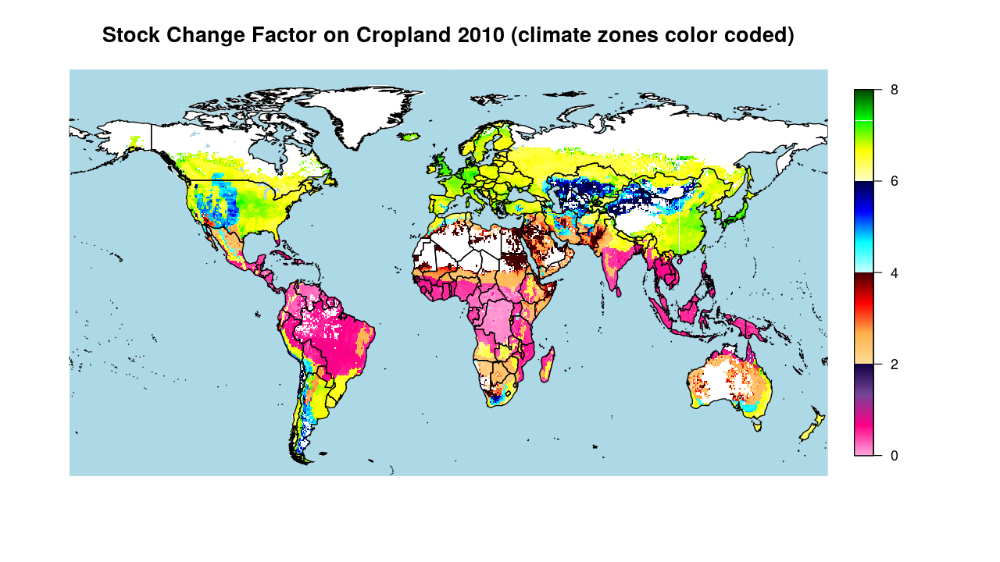

# Results

```{r, out.width = "12cm", echo = FALSE, fig.cap = "two column figure", fig.show='hold'}

```

```{r, out.width = "12cm", echo = FALSE, fig.cap = "two column figure", fig.show='hold'}

```

```{r, out.width = "12cm", echo = FALSE, fig.cap = "two column figure", fig.show='hold'}

```

```{r, out.width = "12cm", echo = FALSE, fig.cap = "two column figure", fig.show='hold'}

```


```{r, out.width = "12cm", echo = FALSE, fig.cap = "two column figure", fig.show='hold'}
knitr::include_graphics(c("images/maps/CShare_1965.png","images/maps/CShare_2010.png"))
```

```{r, out.width = "12cm", echo = FALSE, fig.cap = "two column figure", fig.show='hold'}
knitr::include_graphics(c("images/maps/CIncrease_1965.png","images/maps/CIncrease_2010.png"))
```

```{r, out.width = "12cm", echo = FALSE, fig.cap = "one column figure"}

```
