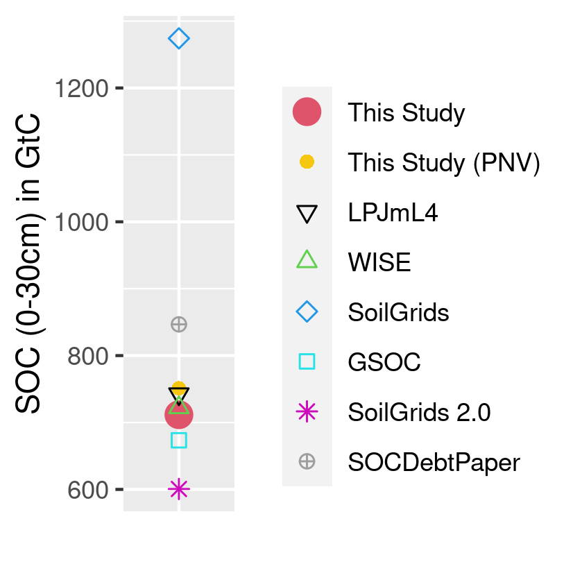

# Results

Detailed results for the spatially explicit global SOC budget including intermediate results on input data as well as SOC stock results for all scenario runs can be found in Karstens [-@karstens_model_2020]. In the following, the most important results [see @karstens_result_2020] for post-processing script) are summarized. Additionally, we compared our model results to other literature estimates within the last section (see Sect. \@ref(sec:validate)).

## SOC distribution and depletion

```{r captionSOCmaps, echo=FALSE}
captionSOCmaps <- "(a): Distribution of total global SOC stocks for the first 30 cm on cropland:  Carbon stocks are large in high yielding areas. (b)+(c): Absolute (b) and relative (c) SOC stocks changes compared to a potential natural state identify different hotspots of SOC dynamics. Whereas absolute losses $\\Delta SOC$ are often highest in temperate dry regions, relative losses $F^\\mathrm{SCF}$ are often larger in tropical moist areas. (d): $\\Delta SOC$ between SOC under historic land use and potential natural vegetation is increasing over time, meaning net SOC losses on global croplands over the period 1975--2010. The speed of SOC losses is however decreasing."
```

```{r SOCmaps, out.width = "18cm", fig.cap = captionSOCmaps, echo=FALSE, fig.pos="h"}
# All defaults
knitr::include_graphics("../ResultNotebooks/Output/Images/4panelfigure.png")
```

In Fig. \@ref(fig:SOCmaps)(a) we provide a world map of SOC stocks for the first 30 cm on croplands considering historic management data at the global scale for the year 2010. Values ranging between well over $100\unit{t ha^{-1}}$ in northern temperate croplands to less than $5\unit{t ha^{-1}}$ for arid and semiarid croplands. 
Our spatially explicit results show hotspots of SOC losses and gains compared to SOC under potential natural vegetation in two complementary ways: 
1. Absolute SOC changes $\Delta SOC$ (see Fig. \@ref(fig:SOCmaps)(b)) indicate areas with high importance for the global SOC losses. They might be driven by large relative changes (e.g. in Central Africa) or by a high natural stock, from which even small relative deviations could lead to substantial absolute losses (e.g. North-East Asia). 
2. Relative SOC changes measured as stock changes factors $F^{SCF}$ (see Fig. \@ref(fig:SOCmaps)(c)) are a helpful metric to analyze the impact of human cropping activities. They indicate areas with large differences in carbon inflows or SOC decay compared to natural vegetation, that may hold potential to be overcome due to improved agricultural practices. Large parts of tropical croplands seem to suffer from low stock changes factors, meaning high relative SOC losses and maybe indicating SOC degradation. Conversely, irrigated croplands at the border to dry, unsuitable areas worldwide have high stock change factors.

The global SOC debt has increased by about 14% in the period between 1975 and 2010 to $39.6\unit{GtC}$ (Fig. \@ref(fig:SOCmaps)(d)). This corresponds to a loss rate of $0.14\unit{GtC yr^{-1}}$. Considering our estimate of the global SOC stock of around $705\unit{GtC}$ in 1975, global SOC decreased by 0.2 per 1000 per year for the period between 1975--2010. 

## Carbon flows in the agricultural system

```{r caption_FlowFig, echo=FALSE}
caption_FlowFig <- "Global carbon flows within the agricultural system for the year 2010 (in MtC): Carbon is first photosynthesise by crop plants and than used depending on the plant part by humans for feed of livestock and various other usages subsumed under human demand. After accounting for losses within the agricultural system three major C inputs are applied to croplands: manure, above- and below-ground residues. Large parts of C, however, get mineralized on field before entering the soil. Additionally, C is transferred to and from agricultural soils via land-use change to and from natural vegetation. Finally, SOC gets mineralized and flows back into the atmosphere."
```

```{r FlowFig, out.width = "16cm", fig.cap = caption_FlowFig, echo=FALSE, fig.pos="h"}
# All defaults
knitr::include_graphics("../ResultNotebooks/Output/Images/CarbonBudget.png")
```

C is sequestered from the atmosphere via plant growth and allocated to three different plant parts (harvest organ, above- and below-ground residues). Whereas harvested organs as well as above ground-residues are taken (partially) from the field to be used for other purposes, below-ground residues (785 MtC in 2010) are directly returned to the field. We split up usage for crop biomass into feed usage and aggregate all other usage types (e.g. like food, bioenergy and material) into a human demand category. Livestock feed demand for crop harvest and above-ground residues of 1141 MtC is almost equal to the human demand of 1144 MtC. Whereas large parts of feed intake are recycled to the soils via manure (C input from manure at 384 MtC), we assume the carbon demanded from humans (ending up as e.g. compost, night soil and sewage) is not recycled to soils. Besides manure C and below-ground residues, above-ground residues form the largest C input to the soil with 1200 MtC returned to the field in 2010. However, around 60% of C decomposes before its integrated into soils at the the litter-soil barrier. Due to the different C composition, proportional more C enters the slow pool from manure compared to crop residue. According to our model results, land-use change dynamics led to a C transfer from cropland to natural vegetation of 58 MtC in 2010. 4764 MtC sequestered by crop plants face 3897 MtC released within the agricultural system. Accounting for SOC transfer, SOC increase under cropland is around 809 MtC.


## Agricultural management effects on SOC debt

```{r captionSOCscen, echo=FALSE}
captionSOCscen <- "(a) Global $\\Delta SOC$ in GtC for different management scenarios: The stylized scenarios devate from historic argicultural management by holding effects of carbon inflows from residues (constResidues), manure (constManure) constant or neglecting adoption of no-tillage practices (constTillage). ConstManagement combines all three modifications. Note that $\\Delta SOC$ is defined as the difference of SOC under land-use compared to a natural vegetation state. Figure (b) shows the carbon inflows from crop residue and manure, underlining the strong impact of residues for SOC stock and SOC stock changes."
```

```{r SOCscen, out.width="14cm", fig.cap = captionSOCscen, echo=FALSE, fig.pos="h"}
# All defaults
knitr::include_graphics("../ResultNotebooks/Output/Images/scenario_horiz.png")
```

We analyze the relative impact of individual management aspects by comparing the actual historic management scenario with counterfactual scenarios where individual management aspects are kept static at the 1975 values (Figure \@ref(fig:SOCscen)(a)). Without changes in management regimes, the global $\Delta SOC$ on cropland would be decreasing at a rate of $0.14\unit{GtC yr^{-1}}$. As shown by the constResidue scenario, changes in residue return rates dominate the management effects. Without the historic increase in residue returning, the global $\Delta SOC$ would still increase at a rate of $0.19\unit{GtC yr^{-1}}$. Both the constManure and constTillage scenarios show only small deviations from the historic values (loss rate of $0.15\unit{GtC yr^{-1}}$ for both). The effect of no-tillage only became visible from 2000 onwards. 
The strong impact of almost doubling C inputs from crop residue biomass over a period of 35 years on agricultural SOC stocks is shown in Fig. \@ref(fig:SOCscen)(b).

## Model validation {#sec:validate}

To evaluate our model results we take five steps: (1) we compare our stock change factors (see Sect. \@ref(#sec:tier1)) to IPCC default assumptions ([@lasco_cropland_in_ipcc_2006], [@ogle_cropland_in_ipcc_2019]); (2) we compare our global (and climate-zone specific) total SOC stocks to other literature estimates; (3) we contrast our results to point measurements; (4) to evaluate the representation of our natural SOC stocks we correlated LPJmL4 SOC stocks for potential natural vegetation with our natural state SOC results on grid level; and (5) we do a similar correlation analysis for our modeled actual SOC stocks in comparison to the results of SoilGrids 2.0 [@poggio_soilgrids_2021].   

### Stock change factors compared to IPCC assumptions {#sec:ipcccompare}

To validate our modeled SOC stocks and stock changes under management, we compare our results to default IPCC stock changes factors $F^{\\mathrm{SCF}}$ of 2006 [@lasco_cropland_in_ipcc_2006] and their refinements in 2019 [@ogle_cropland_in_ipcc_2019]. Both estimates are based on measurement data for croplands (see Table \@ref(tab:SCFglo)). To allow for comparison, we aggregate our stock change factors to the four IPCC climate zones (Fig. \@ref(fig:CLIMzone)) by weighting grid-level $F^{\\mathrm{SCF}}$ with cropland area.

```{r SCFglo, echo=FALSE, results = 'asis'}
table <- readRDS("../ResultNotebooks/Output/SFC_comparison.rds")
library(xtable)
print(xtable(table$comparison_table, digit=2, label="tab:SCFglo",
              caption="$F^{\\mathrm{SCF}}$ in comparison to IPCC Tier 1 default factors: Stock change factors for temperate climate zones of this study are lower than the default values of the IPCC. For the tropical regions the assumptions changed notablly from the guidelines in 2006 \\citep{lasco_cropland_in_ipcc_2006} to the update in 2019 \\citep{ogle_cropland_in_ipcc_2019}, leaving our results in very good agreement with the old default assumptions. Default assumption are given under the assumption of medium input systems, which, considering the yield gap in mainly developing regions in the tropics, might be an overestimation and decrease $F^{\\mathrm{SCF}}$ by additional 5-8 percent. Modelled $F^{SCF}$ have increased or stayed constant for all climates over time."), comment=FALSE, caption.placement = "top")
```

### Global SOC stocks comparison

We contrast our global SOC stocks with a wide range of global SOC stock estimates for the first 30 cm of the soil profile [@batjes_harmonized_2016; @hengl_soilgrids250m_2017; @fao_global_2018; @schaphoff_lpjml4_2018-1; @poggio_soilgrids_2021; @sanderman_soil_2017] in Fig. \@ref(fig:SOCglo).

```{r captionSOCglo, echo=FALSE}
captionSOCglo <- "Modeled as well as data based estimation for global SOC stock in GtC for the first 30 cm of soil aggregated over all land area: Note that SoilGrids, SoilGrids 2.0, GSOC and WISE do not consider land-use as well as changes over time and rely on soil profile data gather over a long period of time. This makes it hard to pinpoint a specific year for these SOC estimations. In this context they will be compared to modeled data from LPJmL4 for potential natural vegetation, estimates from \\citep{@sanderman_soil_2017} and this study for the year 2010."
```

```{r SOCglo, out.width = "8cm", fig.cap = captionSOCglo, echo=FALSE, fig.pos="h"}
# All defaults

```

The global estimates of the total SOC stock from this study are on the lower end compared to other modeled results or data driven estimates. SoilGrids [@hengl_soilgrids250m_2017] especially stands out for their high estimation, whereas all other sources (including our study) are comparably similar. Looking at regional results in Fig. \@ref(fig:SOCreg), our estimates turn out to be in within the range of other estimates for most of the world, with the largest deviations for polar dry, tropical dry and tropical wet areas.


### SOC point-based validation

We correlate our SOC results for native vegetated and cropped areas in 2010 with literature values from point measurements (for data base see appendix of [@sanderman_soil_2017]).

```{r captionSOCpoint, echo=FALSE}
captionSOCpoint <- "Correlation between modeled and measured SOC stocks: Given the wide span between minimun and maximum measured SOC stocks within in a given cell, we correlated median values with our modeled results. Both cropland and areas with natural vegetation (here called Native) are generally lower within our results compared to the measured data."
```

```{r SOCpoint, out.width = "10cm", fig.cap = captionSOCpoint, echo=FALSE, fig.pos="h"}
# All defaults

```

### Natural SOC stock comparison with LPJmL4

As described in Sect. \@ref(#sec:steadystates) the natural litterfall of LPJmL4 is the carbon input source for the areas with natural vegetation. Here we compare SOC values from a LPJmL4 run for potential natural vegetation with our estimates SOC stocks for a potential natural state. Note that both models see the same climate conditions and the same natural litterfall and just differ within their SOC dynamics including the processing of the litterfall. We restrict the validation data to the year 2010 and only account for grid cells with more than $1000\unit{ha}$ of cropland.  

```{r captionSOCLPJmL4, echo=FALSE}
captionSOCLPJmL4 <- "Correlation between modeled SOC stocks of LPJmL4 and this study for a potential natural state: Spatial correlation of natural SOC stock values are good especially for dry climate zones. For temperate and tropical moist areas estimates of this study tend to be a bit lower compared to LPJmL4 results except some outliers."
```

```{r SOCLPJmL4, out.width = "13cm", fig.cap = captionSOCLPJmL4, echo=FALSE, fig.pos="h"}
# All defaults

```


### Actual SOC stock comparison with SoilGrids 2.0. 

SoilGrids 2.0 [@poggio_soilgrids_2021] is a digital soil mapping approaches that uses over 240 000 soil profile observations to produce high resolution soil maps including SOC stocks and their uncertainties. To evaluate the performance of our model on the global scale we correlate SoilGrids 2.0 SOC stock predictions, that were aggregated to 0.5 degree resolution, to our estimates from 2010 in Fig. \@ref(fig:SOCSoilGrids2). To focus our comparison on cropland areas, we mask out grid cells with less than $1000\unit{ha}$. 
Additionally, we use the uncertainty estimates from SoilGrids 2.0 (fifth and 95th quantile) in Fig. \@ref(fig:SOCSoilGrids2Q) to highlight areas, where our modeled SOC stocks have very low agreement with SoilGrids 2.0 data. 


```{r captionSOCSoilGrids2, echo=FALSE}
captionSOCSoilGrids2 <- "Correlation between modeled SOC stocks of this study and projected values from SoilGrids 2.0: Spatial correlation is fair for tropical climate zones, whereas it is poor for especially temperate moist areas, where our modeled SOC stocks are considerable higher than SoilGrids 2.0 estimates. However, for low SOC stocks thoughout the different climate zones our model results seem to be lower than predicted values by Soil Grids 2.0."
```

```{r SOCSoilGrids2, out.width = "13cm", fig.cap = captionSOCSoilGrids2, echo=FALSE, fig.pos="h"}
# All defaults
knitr::include_graphics("../ResultNotebooks/Output/Images/scatterCompareSoilGrids2_2010_lu.png")
```


```{r captionSOCSoilGrids2Q, echo=FALSE}
captionSOCSoilGrids2Q <- "Global map on SOC results compared to uncertainty estimates from SoilGrids 2.0: For the vast majorty of grid cells our model results are between the fifth and 95th quantile of SoilGrids 2.0 estimates. We underestimate SOC stocks especially close to dry areas (e.g. close to the Sahara) and overestimates stocks for some areas within the center of North America, Middle East Asia and Western South America."
```

```{r SOCSoilGrids2Q, out.width = "14cm", fig.cap = captionSOCSoilGrids2Q, echo=FALSE, fig.pos="h"}
# All defaults


