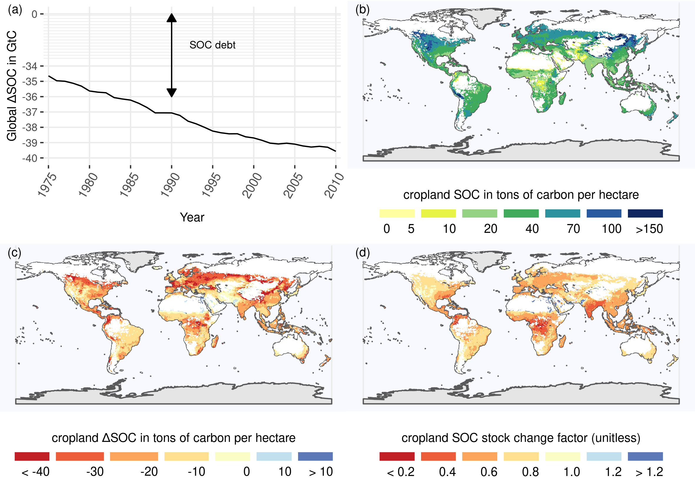

# Results

We present simulation results of our SOC budget focusing on cropland areas for the year 2010 as well as global trends of SOC stock changes for the period from 1975 to 2010.

## SOC distribution and depletion

```{r caption_SOCmaps, echo=FALSE}
caption_SOCmaps <- "(a): Distribution of total global SOC stocks on cropland shows high carbon stocks in high yielding areas. (b): The SOC debt is decreasing over time, meaning net SOC gains on global croplands over the last decades. (c)+(d): Absolute (c) and relative (d) SOC stocks compared to a potential natural state showing different hot spots of SOC dynamics. Whereas the absolute losses might be in temperate dry regions, relative losses are more prominent in tropical moist areas."
```

```{r SOCmaps, out.width = "18cm", fig.cap = caption_SOCmaps, echo=FALSE, fig.pos="H"}
# All defaults

```

In fig. 1(a) we provide the first world map of SOC on croplands considering real world management data on the global scale. Our spatially explicit results moreover show hot spots of SOC losses as well as gains in two different ways: 
1. Absolute SOC changes (see fig. 1(c)) indicate areas with high importance for the global SOC emissions. The might be driven by huge relative losses or a high natural stock, from which even small deviations could lead to substantial losses.
2. To attribute SOC losses to insufficient agricultural management relative SOC changes ($F^{SCF}$, see fig. 1(d)) are a helpful tool. They indicate areas with huge difference in carbon inflows or SOC decay compared to natural vegetation, that might be overcome due to improved agricultural practices.

## Agricultural management effects on SOC emissions and cycling

Global cumulative SOC emissions are decreasing (see fig. 1(c)). Fig. 2 reveals the relative impact of management effects by freezing tillage areas as well as carbon inflows from residues or manure at the level of 1975. Our counterfactual scenarios show that the increasing residue carbon input had the biggest overall effect on SOC stocks. Without changes in management regimes especially in residue inflows to the soil, global cumulative SOC emissions would still grow. The strong effect of carbon residue amounts are also visible in the carbon flow diagram for agricultural production for the year 2010 (see fig. 3)

```{r caption_SOCscen, echo=FALSE}
caption_SOCscen <- "Global SOC gap in GtC for various stylized management counterfactual scenarios compared to the modeled historical baseline."
```

```{r SOCscen, out.width = "18cm", fig.cap = caption_SOCscen, echo=FALSE, fig.pos="H"}
# All defaults
knitr::include_graphics("../ResultNotebooks/Output/Images/scenario.png")
```

```{r caption_FlowFig, echo=FALSE}
caption_FlowFig <- "Global carbon flows (small numbers) and stocks (bold numbers) within the agricultural system for the year 2010 (in MtC): Most important carbon sources on cropland are crop residues. Note the two numbers on carbon inputs to soil denote carbon applied to the field and carbon entering the soil (difference is decomposed before official counting as soil)."
```

```{r FlowFig, out.width = "16cm", fig.cap = caption_FlowFig, echo=FALSE, fig.pos="H"}
# All defaults
knitr::include_graphics("../ResultNotebooks/Output/Images/OuFlowFig.png")
```

\newpage

